## Ejercicio 1 
### Búsqueda Iterativa de óptimos

#### 1. Implementar el algoritmo de gradiente descendente

El Gradiente descendente es un método matemático empleado para encontrar el mínimo (global si la función es convexa y local en otro caso) de una función determinada teniendo en cuenta el gradiente. El gradiente es el vector de las primeras derivadas de la función con respecto a cada una de sus variables y dicho vector apunta en cada punto al máximo de la función, luego en nuestro método en cada paso decidimos ir en dirección contraria a la que apunta el gradiente para así tratar de llegar a un mínimo de la función. 

El algoritmo implementado es el siguiente, que puede verse en el fichero template_trabajo1.py 

~~~python
def gradient_descent(w,eta,num_iterations, error): 
    #
    # gradiente descendente
    # 
    iterations=0 
    Err=1000.0

    while Err>error and iterations<num_iterations:
       partial_derivative=gradE(w[0],w[1])
       w=w - eta*partial_derivative 
       iterations=iterations + 1 
       Err=E(w[0],w[1]) 
        
    return w, iterations  

~~~

Antes de entrar en detalle, comentar que en toda la práctica he procurado utilizar operaciones vectoriales y matriciales en la medida de lo posible en lugar de bucles para mejorar la eficiencia de los algoritmos implementados. Dicho esto continuamos con la explicación.

Este algoritmo está hecho específicamente para la función E(u,v) del apartado siguiente pero se puede generalizar fácilmente para cualquier otra función. Los valores que se pasan como argumento son w (vector que contendrá las coordenadas del mínimo de la función, inicializado a [1 1 ... 1]), eta (la tasa de aprendizaje), num_iterations (contiene las iteraciones máximas que hará el algoritmo) y error (contiene el error a alcanzar).

La idea del algoritmo es, en primer lugar inicializamos las iteraciones a 0 y establecemos un error base de 1000 para ir mejorándolo en el bucle while. 

Una vez hecho esto entramos en el bucle principal del algoritmo, dicho bucle parará si se verifica alguna de las dos condiciones: O bien porque llegamos al número de iteraciones máximas (el valor num_iterations) o bien porque el error cometido (Err) es menor que el establecido por la variable "error" que pasamos como argumento a la función. 

En cada iteración el algoritmo calcula el gradiente de la función a minimizar, lo evalúa en el vector w y esto nos daría el vector que nos apunta hacia el "máximo" de la función. Pues tras esto actualizamos el punto w desplazándolo en la dirección opuesta al gradiente (en dirección a un mínimo local o global) con un paso del tamaño de eta. 

Tras esto evaluamos la función en el nuevo punto, lo que nos dará el error del nuevo punto obtenido (si todo va bien, debería ser menor que el error de la iteración anterior, aunque luego veremos que esto no siempre es así), y si este error es mayor que el que queríamos obtener y aún quedan iteraciones por hacer se repite el mismo procedimiento.

Como podemos ver, el correcto funcionamiento del algoritmo depende entre otras cosas del eta establecido y del punto inicial establecido, hechos que veremos mejor en los ejercicios siguientes.

#### 2. Considerar la función E(u, v) = $\left(\mathrm{e}^{v-2}u^3-2v^2\mathrm{e}^{-u}\right)^2$. Usar gradiente descendente para encontrar un mínimo de esta función, comenzando desde el punto $(u, v) = (1, 1)$ y usando una tasa de aprendizaje $\eta= 0.1$

#### a) Calcular analíticamente y mostrar la expresión del gradiente de la función E(u, v) 

1. La función E(u,v)=$\left(\mathrm{e}^{v-2}u^3-2v^2\mathrm{e}^{-u}\right)^2$
   
~~~python
def E(u,v):
    return  (u**3*np.e**(v-2)-2*v**2*np.e**(-u))**2
~~~

2. Las derivadas parciales con respecto a u y v, que serían $\frac {\partial} {\partial u} E(u,v)= 2\left(\mathrm{e}^{v-2}u^3-2v^2\mathrm{e}^{-u}\right)\left(2v^2\mathrm{e}^{-u}+3\mathrm{e}^{v-2}u^2\right)$ y $\frac {\partial} {\partial v} E(u,v)=2\left(u^3\mathrm{e}^{v-2}-4\mathrm{e}^{-u}v\right)\left(u^3\mathrm{e}^{v-2}-2\mathrm{e}^{-u}v^2\right)$ 

~~~python
#Derivada parcial de E con respecto a u
def dEu(u,v):
    return 2*(np.e**(v-2)*u**3-2*v**2*np.e**(-u))*(2*v**2*np.e**(-u)+3*np.e**(v-2)*u**2)
    
#Derivada parcial de E con respecto a v
def dEv(u,v):
    return 2*(u**3*np.e**(v-2)-4*np.e**(-u)*v)*(u**3*np.e**(v-2)-2*np.e**(-u)*v**2)
    
~~~

3. Finalmente la funcion gradiente de E, que nos calcula el vector ($\frac {\partial} {\partial u} E(u,v),\frac {\partial} {\partial v} E(u,v)$)
   
~~~python
#Gradiente de E
def gradE(u,v):
    return np.array([dEu(u,v), dEv(u,v)])
~~~
#### b)¿Cuántas iteraciones tarda el algoritmo en obtener por primera vez un valor de E(u,v) inferior a 10^(-14) ?.

#### c)¿En qué coordenadas (u,v) se alcanzó por primera vez un valor igual o menor a 10^-14 en el apartado anterior?

Una vez tenemos todo esto, como el enunciado nos especifica los valores $\eta=0.1$ y punto inicial $(u,v)=(1,1)$ tenemos ya todos los ingredientes necesarios para ejecutar el algoritmo de gradiente descendente, solo nos quedaría especificar el error a conseguir y las iteraciones máximas, yo las he establecido en los valores que venían en el template:

~~~python
eta = 0.1 
maxIter = 10000000000 
error2get = 1e-14 #Error a alcanzar
initial_point = np.array([1.0,1.0])
w, it = gradient_descent(initial_point, eta,maxIter, error2get) 
~~~

Con estos valores los resultados obtenidos por el algoritmo de gradiente descendente serían:

~~~
Funcion a minimizar: E(u,v)=(u^3*e^(v-2)-2*v^2*e^(-u))^2
Gradiente: [2*(e^(v-2)*u^3-2*v^2*e^(-u))*(2*v^2*e^(-u)+3*e^(v-2)*u^2), 2*(u^3*e^(v-2)-4*e^(-u)*v)*(u^3*e^(v-2)-2*e^(-u)*v^2)]
Numero de iteraciones:  10
Coordenadas obtenidas: ( 1.1572888496465497 ,  0.9108383657484797 )
~~~

Es decir, el algoritmo ha tardado 10 iteraciones en llegar a un valor de la función inferior al establecido y el primer punto donde se alcanza un valor de la función menor o igual al error establecido serían las coordenadas obtenidas. Por lo que como podemos ver, se trata de un algoritmo que puede ser muy eficiente y rápido para encontrar mínimos.

Finalmente representamos los resultados obtenidos en un gráfico usando el código de ejemplo que venía en el template:

Dicho código es:

~~~python
x = np.linspace(-30, 30, 50)
y = np.linspace(-30, 30, 50)
X, Y = np.meshgrid(x, y)
Z = E(X, Y) #E_w([X, Y])
fig = plt.figure()
ax = Axes3D(fig)
surf = ax.plot_surface(X, Y, Z, edgecolor='none', rstride=1,
                        cstride=1, cmap='jet')
min_point = np.array([w[0],w[1]])
min_point_ = min_point[:, np.newaxis]
ax.plot(min_point_[0], min_point_[1], E(min_point_[0], min_point_[1]), 'r*', markersize=10)
ax.set(title='Ejercicio 1.2. Función sobre la que se calcula el descenso de gradiente')
ax.set_xlabel('u')
ax.set_ylabel('v')
ax.set_zlabel('E(u,v)')
plt.show()
~~~

En resumen, generamos un vector x e y de 50 puntos equidistantes entre -30 y 30, los juntamos en una rejilla usando la función meshgrid, evaluamos los valores de la rejilla en la función E(u,v) y la representamos en 3 Dimensiones usando la función plot_surface.

Finalmente representamos el mínimo en el mismo gráfico usando la función plot, donde le pasamos la coordenada u, v, el valor de la función en ese punto y queremos que se represente como una estrella roja, por eso usamos 'r*' y de tamaño 10.

#### 3. Considerar ahora la función $f(x,y)= 2\sin\left(2{\pi}x\right)\sin\left(2{\pi}y\right)+2\left(y-2\right)^2+\left(x+2\right)^2$

Igual que antes calculamos las derivadas parciales y el gradiente, e implementamos el gradiente descendente de acuerdo a la nueva función (es idéntico al del apartado anterior salvo que la función y el gradiente cambian y que no se especifica error)

1. La función $f(x,y)=2\sin\left(2{\pi}y\right)\sin\left(2{\pi}x\right)+\left(x+2\right)^2+2\left(y-2\right)^2$
   
~~~python
def f(x,y):
    return  (x+2)**2 + 2*(y-2)**2 + 2*np.sin(2*np.pi*x)*np.sin(2*np.pi*y)
~~~

2. Las derivadas parciales con respecto a x e y, que serían $\frac {\partial} {\partial x} f(x,y)= 4{\pi}\sin\left(2{\pi}y\right)\cos\left(2{\pi}x\right)+2\left(x+2\right)$ y $\frac {\partial} {\partial y} f(x,y)=4{\pi}\sin\left(2{\pi}x\right)\cos\left(2{\pi}y\right)+4\left(y-2\right)$ 

~~~py
#Derivada parcial de f con respecto a x
def dfx(x,y):
    return 4*np.pi*np.sin(2*np.pi*y)*np.cos(2*np.pi*x)+2*(x+2)
    
#Derivada parcial de f con respecto a y
def dfy(x,y):
    return 4*np.pi*np.sin(2*np.pi*x)*np.cos(2*np.pi*y)+4*(y-2)
~~~

3. La funcion gradiente de $f(x,y)$, que nos calcula el vector ($\frac {\partial} {\partial x} f(x,y),\frac {\partial} {\partial y} f(x,y)$)
   
~~~py
def gradf(x,y):
    return np.array([dfx(x,y), dfy(x,y)])
~~~

4. Finalmente el algoritmo del gradiente descendente.

~~~py
def gradient_descent2(w,eta,num_iterations):
    #
    # gradiente descendente
    # 
    iterations=0 
    vector_puntos=np.array([[w[0],w[1]]])
    while iterations<num_iterations:
       h_x=f(w[0],w[1])
       partial_derivative=gradf(w[0],w[1])
       w=w -(eta*np.transpose(partial_derivative))
       iterations=iterations + 1 
       Err=f(w[0],w[1])
       vector_puntos=np.append(vector_puntos, [[w[0],w[1]]], axis=0)
          
    
    return w, iterations,vector_puntos
~~~
como comentario al gradiente descendente, en este caso, también devuelvo el vector de puntos que he ido generando en cada iteración para poder hacer las gráficas del apartado siguiente.

#### a) Usar gradiente descendente para minimizar esta función. Usar como punto inicial $(x_0=-1, y_0=1)$, tasa de aprendizaje $eta=0.01$ y un máximo de 50 iteraciones. Repetir el experimento pero usando $\eta=0.1$, comentar las diferencias y su dependencia de $\eta$.

Tras las 50 iteraciones los resultados obtenidos para $\eta = 0.01$ y el punto inicial $(x_0=-1, y_0=1)$ son: 

~~~
Numero de iteraciones:  50
Coordenadas obtenidas con eta=0.01 : ( -1.269064351751895 ,  1.2867208738332965 )
valor obtenido:  -0.3812494974381
~~~

y usando $\eta=0.1$ los valores obtenidos por el algoritmo son: 

~~~
Funcion a minimizar: f(x,y)=(x+2)^2 + 2*(y-2)^2 + 2*sin(2*pi*x)*sin(2*pi*y)
Gradiente: [4*pi*sin(2*pi*y)*cos(2*pi*x)+2*(x+2), 4*pi*sin(2*pi*x)*cos(2*pi*y)+4*(y-2)]
Numero de iteraciones:  50
Coordenadas obtenidas con eta=0.1: ( -2.8537959548927576 ,  1.9803903507510756 )
valor obtenido:  0.5343830643374345
~~~

Aparentemente, podemos pensar que el learning rate no ha influido mucho, pues en realidad, la distancia al 0 obtenida por los dos algoritmos ha sido muy similar (en valor absoluto), en cambio, si generamos un gráfico que nos muestre como descendía el valor de la función en cada iteración del gradiente descendente vemos lo siguiente: 

--------------------------------------------------------------

Y ahora si que podemos ver una gran diferencia entre la elección de un $\eta$ u otro, y es que si el eta es demasiado grande (como ocurre con el $0.1$) puede ser que en cada iteración el paso que demos sea excesivamente grande y se puede dar el caso de que "saltamos" por encima del mínimo, y en cierto modo podemos quedarnos oscilando en torno al mínimo de la función. Por eso observamos en la gráfica valores tan dispares para la función $f(x,y)$ en cada iteración.

En cambio, con el valor 0.01, al ser los pasos en cada iteracion menores, se asegura una mejor convergencia al mínimo, y una vez alcanzado dicho mínimo, la función permanece constante (pues el gradiente es prácticamente 0 y en cada iteración los valores de los pesos no se modifican a penas).

En resumen un $\eta$ menor nos asegura la convergencia, aunque muy lentamente y un $\eta$ mayor aunque avanza con más rapidez el algoritmo puede no converger, por ello la elección de un eta adecuado es importante.

Por lo que dicho esto, parece mucho más razonable utilizar $\eta=0.01$ que $\eta=0.1$

#### b) Obtener el valor mínimo y los valores de las variables $(x,y)$ en donde se alcanzan cuando el punto de inicio se fija en: $(-0.5,-0.5), (1,1), (2.1,-2.1), (-3,3), (-2,2)$. Generar una tabla con los valores obtenidos. Comentar la dependencia del punto inicial.

En este caso los valores obtenidos son estos: 

~~~
Puntos iniciales (x,y)= ( -0.5 , -0.5 )
Numero de iteraciones:  50
Coordenadas obtenidas: ( -0.7934994705090673 ,  -0.12596575869895063 )
valor obtenido:  9.125146662901855

--------------------------

Puntos iniciales (x,y)= ( 1 , 1 )
Numero de iteraciones:  50
Coordenadas obtenidas: ( 0.6774387808772109 ,  1.290469126542778 )
valor obtenido:  6.4375695988659185

--------------------------

Puntos iniciales (x,y)= ( 2.1 , -2.1 )
Numero de iteraciones:  50
Coordenadas obtenidas: ( 0.14880582855887767 ,  -0.09606770499224294 )
valor obtenido:  12.490971442685037

--------------------------

Puntos iniciales (x,y)= ( -3 , 3 )
Numero de iteraciones:  50
Coordenadas obtenidas: ( -2.7309356482481055 ,  2.7132791261667037 )
valor obtenido:  -0.38124949743809955

--------------------------

Puntos iniciales (x,y)= ( -2 , 2 )
Numero de iteraciones:  50
Coordenadas obtenidas: ( -2.0 ,  2.0 )
valor obtenido:  -4.799231304517944e-31
~~~

Como podemos observar se obtienen resultados muy dispares y no se enteiende bien a simple vista qué está ocurriendo, por eso para entender un poco mejor lo que está pasando he realizado el siguiente gráfico: 

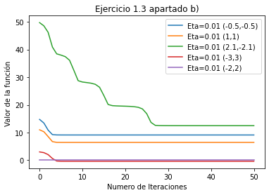
-------------------------------------------------------

Colocándolos en una tabla quedan de la siguiente forma: 

|Punto inicial| w obtenido | f(w)|
|--| -- | --|
|( -0.5 , -0.5 )|( -0.7934994705090673 ,  -0.12596575869895063 )|9.125146662901855|
|( 1 , 1 )|( 0.6774387808772109 ,  1.290469126542778 )|6.4375695988659185|
|( 2.1 , -2.1 )|( 0.14880582855887767 ,  -0.09606770499224294 )|12.490971442685037|
|( -3 , 3 )|( -2.7309356482481055 ,  2.7132791261667037 )|-0.38124949743809955|
|( -2 , 2 )|( -2.0 ,  2.0 )|-4.799231304517944e-31|
------------------------------------

Como podemos observar la elección del punto inicial es clave para encontrar un mínimo local u otro. Por ejemplo empezando en el $(1,1)$ el algoritmo se queda en el punto $( 0.6774387808772109 ,  1.290469126542778 )$, que es un mínimo local de la función, pero no un mínimo global, y lo mismo ocurre con los demás puntos, y es que si representamos la función en 3 dimensiones: 

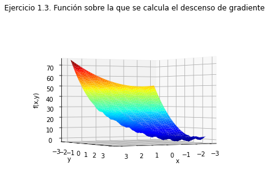
--------------------------------------------------------

Podemos ver que no es una superficie lisa, sino que tiene como "hoyos" donde nuestro algoritmo puede quedarse "atrapado" dependiendo del valor que tomemos como punto inicial. Cabe destacar el caso del punto inicial (2.1, -2.1) pues en este caso, el algoritmo como podemos observar va sorteando distintos hoyos donde parece que va a quedarse atrapado, hasta llegar a uno donde se queda atrapado y ya permanece constante.

Como comentario sobre la forma en que se han creado las distintas gráficas, para las gráficas que son en 2 dimensiones con las iteraciones y el valor de la función he usado este código: 

~~~py
imagenes=[]
for i in vector_puntos:
    imagenes.append(f(i[0],i[1]))

iteraciones=np.arange(it+1)
plt.plot(iteraciones, imagenes, label='etiqueta')
~~~

Donde he ido generando para cada elemento del vector de puntos devuelto por el gradiente descendente su correspondiente imagen y luego con la función plot he representado en un gráfico las iteraciones y las imágenes. 

Finalmente añadiendo plt.show() mostraba en el mismo gráfico todas las funciones juntas. 

por otro lado, para la última gráfica he usado el mismo código del ejercicio 1.2.

#### 4.¿Cuál sería su conclusión sobre la verdadera dificultad de encontrar el mínimo global de una función arbitraria?

Por todo lo visto en apartados anteriores, la dificultad para encontrar el mínimo global de una función arbitraria, a mi modo de entender, reside en la correcta elección del punto inicial donde lanzar el algoritmo y de el $\eta$ adecuado, pues como vimos en el ejercicio 1.2 un $\eta$ demasiado grande puede hacer que nuestro algoritmo no converga al mínimo, y como vimos en el ejercicio 1.3, con un $\eta$ adecuado, si no tomamos un buen punto de partida, nuestro algoritmo puede no converger al mínimo global y quedar atrapado en mínimos locales. Por lo tanto a mi parecer, dada una función arbitraria $f(x,y)$ (que no sea convexa) sería una buena práctica, tomar un conjunto arbitrario de puntos iniciales y un conjunto arbitrario de posibles valores de $\eta$ y llevar a cabo un estudio de con qué punto inicial y con qué valor de $\eta$ se alcanza el "mejor" mínimo de la función.

## Ejercicio 2
### Regresión lineal

Este ejercicio ajusta modelos de regresión a vectores de características extraidos de imágenes de digitos manuscritos. En particular se extraen dos características concretas que miden: el valor medio del nivel de gris y la simetría del número respecto de su eje vertical. Solo se seleccionarán para este ejercicio las imágenes de los números 1 y 5.

### Ejercicio 2.1
#### Estimar un modelo de regresión lineal a partir de los datos proporcionados por los vectores de características (Intensidad promedio, Simetría) usando tanto el algoritmo de la pseudo-inversa como el Gradiente Descendente Estocático (SGD). Las etiquetasa serán (-1,1), una por cada vector de cada uno de los números. Pintar las soluciones obtenidas junto con los datos usados en el ajuste. Valorar predicciones usando Ein y Eout (para E out calcular las predicciones usando los datos del fichero de test)

En primer lugar, vamos a implementar el algoritmo de la pseudoinversa, dicho algoritmo es el siguiente: 

---------------------------------------------------------

Que surge de la problemática de que no se conoce a priori que la matriz X sea invertible, por lo que para despejar el vector de pesos w de la ecuación se recurre a la pseudoinversa, un producto matricial utilizando los valores singulares de la matriz X que sí sabemos que es siempre invertible.

~~~py
# Pseudoinversa	
def pseudoinverse(x,y,w):

    pseudoinverse=np.linalg.pinv(np.transpose(x).dot(x))
    X=pseudoinverse.dot(np.transpose(x))
    w=X.dot(y)
    return w
~~~

Por ello en primer lugar calculamos el producto de X transpuesto por X y a dicho producto le calculamos la pseudoinversa con la función np.linalg.pinv() (que calcula la pseudoinversa con la descomposición en valores singulares vista en clase) y el resultado lo almacenamos en una variable llamada pseudoinverse. Después calculamos el producto matricial de pseudoinverse con X transpuesta y ya tendríamos la X con la cruz (pseudoinversa de X) y por tanto solo faltaría multiplicar esa matriz por las etiquetas y y obtendríamos de forma directa los pesos del vector w.

En segundo lugar implementamos el Gradiente Descendente Estocástico (SGD), el cual es el siguiente: 

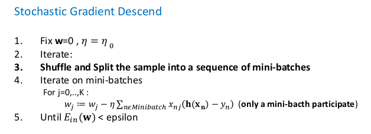
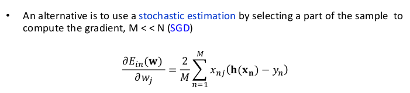
----------------------------------------------------------------

El cual, a diferencia del Gradiente Descendente del ejercicio 1, se caracteriza por que en cada iteración del bucle principal, se mezclan los datos de la matriz X y el vector de los pesos no se actualiza teniendo en cuenta todas y cada una de las filas de la matriz X de características, sino que dividimos dicha matriz en Mini Batches (pequeños subgrupos) e iterando sobre dichos subgrupos vamos actualizando el vector de pesos w tomando en consideración únicamente las filas de cada Mini Batch. Y dado que estamos empleando dicho algoritmo para una función lineal, tenemos una expresión para las derivadas parciales (Foto SGD 2) que como podemos ver toma únicamente los M valores del Mini Batch (con M < N siendo N el número de filas de la matriz X). 

Las ventaja de este algoritmo con respecto al Gradiente Descendente básico es principalmente la ganancia de tiempo en ejecución, pues este algoritmo suele ser más rápido para conjuntos de datos muy grandes.

Dicho esto, el código sería el siguiente:

~~~py
# Gradiente Descendente Estocastico
def sgd(x,y,eta,num_iterations,error,tam_Minibatch=1):
    N=len(y) #Numero de filas de X e y
    iterations=0
    Error=1000.0
    w=np.ones(x.shape[1]) 
    w=w.reshape(-1,1) #Lo transformo en un vector columna
    
    xy=np.c_[x.copy(),y.copy()] 

    while Error>error and iterations<num_iterations:
        #https://realpython.com/gradient-descent-algorithm-python
            
        np.random.shuffle(xy) #Mezclo los datos 

        for i in range(0,N,tam_Minibatch): 
            parada= i + tam_Minibatch
            x_mini,y_mini=xy[i:parada, :-1], xy[i:parada,-1:]
            h_x= np.dot(x_mini,w)
            partial_derivative = (2/tam_Minibatch)*np.dot(np.transpose(h_x - y_mini),x_mini) 
            w=w - eta*np.transpose(partial_derivative)
            
        iterations=iterations + 1 
        Error= Err(x,y,w)
        
    return w
~~~

La función necesita como parámetros la matriz X de características, el vector y de etiquetas, el eta o tasa de aprendizaje, el error a alcanzar y el tamaño del minibatch (si no se especifica este último parámetro se usa un tamaño 1).

Dicho esto, en primer lugar capturamos el número de filas de la matriz X, inicializamos las iteraciones a 0, el Error a 1000 y creamos el vector de pesos inicializado a unos, de longitud tanta como columnas tenga la matriz X, después a la matriz X le concatenamos al final el vector y de etiquetas. La razón por la que hacemos esto último es porque vamos a mezclar las filas de dicha matriz xy para luego dividirlas según los minibatches y no queremos que al mezclar la matriz X perdamos su correspondiente etiqueta en y.

En segundo lugar comienza el bucle principal, cuyas condiciones de parada son las mismas que en el Gradiente Descendente básico. En cada iteración de este bucle empezamos mezclando aleatoriamente las filas de la matriz xy y después iteramos por los minibathces (de tamaño especificado en la variable tam_minibatch). Para ello defino un bucle for anidado en el while que va desde 0 a N(número de filas de la matriz X) y va saltando según el tamaño de Minibatch (de 10 en 10, de 30 en 30, según se especifique en Tam_Minibatch). 

En el bucle for lo que hacemos es tomar las correspondientes filas de la matriz xy según el tamaño del minibatch y definimos las variables x_mini e y_mini, que contienen el sobconjunto de datos correspondiente al minibatch, y con dichos datos aplicamos el algoritmo de gradiente descendente explicado en el ejercicio 1 y actualizamos el vector de pesos.

Al salir del for aumentamos las iteraciones en 1 y calculamos el error.

Por último, el error tanto para SGD como para la pseudoinversa una vez se tiene el vector de pesos es el error cuadrático medio, implementado en la siguiente función:

~~~py
# Funcion para calcular el error
def Err(x,y,w): #Los parámetros son la matriz x de características,  
                #el vector y de etiquetas y el vector w de pesos
    N=len(y) #Calculo el número de filas de y
    producto=x.dot(w)
    Err=(1/N)*(np.transpose(producto-y).dot(producto-y))
    return Err.item()
~~~

La cual en producto nos calcula para cada fila de X su correspondiente imagen con los pesos obtenidos, y después le restamos el vector y de etiquetas reales. Finalmente multiplicamos el vector resultante por su transpuesto obteniendo la sumatoria de las diferencias al cuadrado y por último se hace la media dividiendo por N.

Una vez hecho esto, leemos los datos del fichero correspondiente usando las funciones que nos venían implementadas en el template y separamos los datos en x, y, x_test e y_test. 

Como comentario, decir que en el fichero del código hay una región comentada en la cual hice un experimento para saber con que valor de eta y para que tamaño de minibatch el ajuste era mejor. Para ello generé 10 valores de eta equiespaciados entre 0.01 y 0.5 y para cada valor de eta probé con tamaños de minibatch desde 1 a 100, obteniendo el mejor resultado para eta=0.6444 y tamaño de minibatch 34.

No obstante, el código es my costoso computacionalmente, y en la práctica utilizo un eta=0.1 y un tamaño de minibatch de 32, pues suele ser un valor muy utilizado y que da buenos resultados. Finalmente realizo 200 iteraciones, pues con más iteraciones el error mejoraba muy poco, y era más costoso computacionalmente.
Finalmente comentar que el Ein se calcula empleando las etiquetas y características del training set y el Eout con las del test set.

Dicho esto, los resultados obtenidos con el SGD fueron: 

~~~
Bondad del resultado para grad. descendente estocastico:

Uso eta=0.1, error=1e-14 , max_iteraciones=200 y w inicializado a un vector de unos
w final:  [[-1.11497483]
 [-1.22504639]
 [-0.51067538]]
Ein:  0.08114200106209532
Eout:  0.1368935739925718
~~~

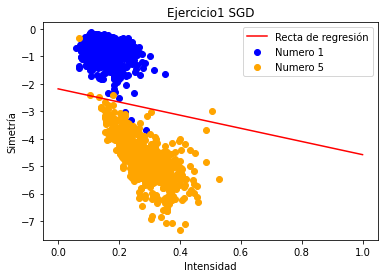
---------------------------------------------------------

Los resultados obtenidos para la Pseudoinversa fueron:

~~~
Bondad del resultado para algoritmo de la pseudoinversa:

w final:  [[-1.11588016]
 [-1.24859546]
 [-0.49753165]]
Ein:  0.07918658628900395
Eout:  0.13095383720052559
~~~

---------------------------------------------------------

Como podemos ver los resultados son muy similares para los dos algoritmos y la recta de regresión separa bastante bien los datos del training set cometiendo un error muy bajo. No obstante, a pesar de que el ajuste empeora en el test set, el error cometido sigue siendo bajo, y se podría decir que separa adecuadamente las fotografías de números 1 y 5.

Por último, para el código que he empleado para representar las gráficas me ha ayudado una compañera de clase, Celia Arias Martínez. En primer lugar capturo las filas de X con etiqueta -1 y luego las que tienen etiqueta 1, y las represento en un scatter plot, después de la fórmula $h(x)=w_0 + w_1*x_1 + w_2*x_2$ despejo una de las dos incógnitas (en mi caso x2) y expreso la función de la siguiente forma $x_2=\frac {w_0+w_1*x_1}{w_2}$ tomando $x_1$ como un parámetro y simplemente eligiendo 100 valores equiespaciados entre 0 y 1 y sustituyéndolos por $x_1$ en la función, usando plt.plot() la dibujo en el gráfico, pasando como parámetros los puntos donde evalúo la función, la función dónde se evalúan, el color de la recta (rojo en mi caso) y la etiqueta. Finalmente le pongo un título al gráfico con plt.Title, le pongo nombre a los ejes con plt.xlabel y plt.ylabel, con plt.legend() creo la leyenda y muestro el gráfico con plt.show().

El código con el que se han generado es el siguiente:

~~~py
y0 = np.where(y == -1) #capturo los índices de los elementos con -1
y1 = np.where(y == 1) #capturo los índices de los elementos con 1
#x_2 contiene dos arrays, uno en cada componente, el primero tiene los
#valores de x con etiqueta -1 y la segunda los de etiqueta 1
x_2 = np.array([x[y0[0]],x[y1[0]]])

#Dibujamos los puntos con etiqueta 1
plt.scatter(x_2[0][:, 1], x_2[0][:, 2],  c = 'blue', label = 'Numero 1') 
#Dibujamos los de etiqueta -1
plt.scatter(x_2[1][:, 1], x_2[1][:, 2],  c = 'orange', label = 'Numero 5')
#Tomo 100 valores equiespaciados para evaluarlos en la función obtenida en sgd
t = np.linspace(0,1, 100) 
#Para representarlo, despejo x2 de la ecuación y represento la función resultante en 2D
plt.plot( t, (-w[0]-w[1]*t)/w[2], c = 'red', label='Recta de regresión') 
plt.legend()
plt.title("Ejercicio1 SGD")
plt.xlabel('Intensidad')
plt.ylabel('Simetría')
plt.figure()
plt.show()
~~~

### Ejercicio 2.2
#### En este apartado exploramos como se transforman los errores Ein y Eout cuando aumentamos la complejidad del modelo lineal usado. Ahora hacemos uso de la función simula_unif(N,2,size) que nos devuelve N coordenadas 2D de puntos uniformemente muestreados dentro del cuadrado definido por [-size,size]x[-size,size]
### Experimento 
#### a) Generar una muestra de entrenamiento de N=1000 puntos en el cuadrado X=[-1,1]x[-1,1]. Pintar el mapa de puntos 2D. (ver función de ayuda)

En primer lugar establezco una semilla para los procesos aleatroios que sucedan en este apartado y los siguientes, y después con la función simula_unif() genero los puntos y hago un scatter plot obteniendo estos resultados: 

~~~py
#Establezco la semilla para que los procesos aleatorios sean reproducibles en cualquier máquina
np.random.seed(2) 
#Genero mil puntos en el cuadrado [-1,1]x[-1,1]
X=simula_unif(1000,2,1)

# Dibujo el Scatter Plot de los puntos generados
plt.scatter(X[:,0],X[:,1], c='purple')
#Los muestro todos juntos
plt.title('Ejercicio2.2 a) Puntos generados')
plt.show();
~~~

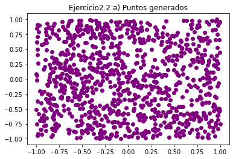

---------------------------------------------------------

#### b) Consideramos la función $f(x_1, x_2)=sign((x_1-0.2)^2+ x_2^2-0.6)$ que usaremos para asignar una etiqueta a cada punto de la muestra anterior. Introducimos ruido sobre las etiquetas cambiando aleatoriamente el signo de un 10% de las mismas. Pintar el mapa de etiquetas obtenido.

En primer lugar definimos la función que usaremos para asignar las etiquetas: 

~~~py
def sign(x):
	if x >= 0:
		return 1
	return -1

def f1(x1, x2):
    x=(x1-0.2)**2 + x2**2 -0.6
    return sign(x)
~~~

En segundo lugar, genero el vector de etiquetas, para ello itero sobre las filas de X y evalúo cada fila en la función definida anteriormente. Para añadir ruido, convierto los datos en un DataFrame de Pandas que tiene funciones útiles para esto y usando la función sample, tomo una muestra aleatoria de un 10% de los datos y multiplico las etiquetas de dichos datos por -1 para cambiar su signo.

~~~py
y=[] #Vector de etiquetas
for i in X:
    y.append(f1(i[0],i[1])) #para cada fila de X genero el valor de su
    #etiqueta correspondiente en y usando la función del ejercicio

X_=pd.DataFrame(data=X); #Convierto la matriz X en un Dataframe de
#Pandas, que es más cómodo de usar 
X_=X_.sample(frac=0.10,random_state=1); #Hacemos que tome un 10% de
#los datos de forma aleatoria para generar ruido en la muestra

for i in X_.index:
    y[i]=y[i]*-1 #Cambio el signo de esos elementos

~~~

Finalmente realizo un scatterplot, coloreando los puntos según su etiqueta, usando como vector de colores el vector de etiquetas y, las moradas tiene y=1 y las amarillas y=-1:

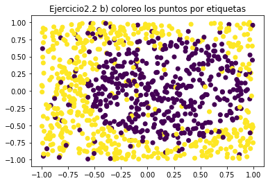
---------------------------------------------------------

#### c) Usando como vector de características $(1,x_1,x_2)$ ajustar un modelo de regresión lineal al conjunto de datos generado y estimar los pesos w. Estimar el error de ajuste Ein usando Gradiente Descendente Estocástico (SGD).

En primer lugar convertimos el vector y en un np.array() y lo transformamos en un vector columna. Después creamos un vector de unos que añadimos a la matriz x de características como primera columna.
Una vez hecho esto aplicamos el algoritmo del SGD del ejercicio anterior y obtenemos los siguientes resultados:

~~~
Bondad del resultado para grad. descendente estocastico:

Uso eta=0.1, error=1e-14 , max_iteraciones=200 y w inicializado a [1. ... 1. 1.]
w final:  [[ 0.06313292]
 [-0.44071531]
 [-0.09348305]]
Ein:  0.9278055026514189
~~~
Y representando los datos gráficamente de la misma forma que en elercicio 2.1. 

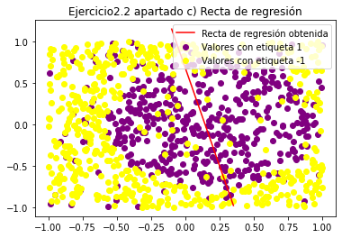
---------------------------------------------------------

Finalmente para validar los resultados aplico el algoritmo de la pseudoinversa, y vemos que obtenemos unos resultados muy similares:

~~~
Bondad del resultado para pseudoinversa:

Uso eta=0.1, error=1e-14 , max_iteraciones=200 y w inicializado a [1. ... 1. 1.]
w final:  [[ 0.06454124]
 [-0.43939414]
 [-0.09368047]]
Ein:  0.9278030562928541
~~~

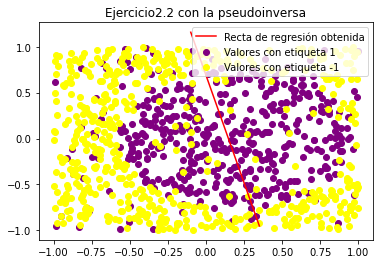
---------------------------------------------------------

#### d) Ejecutar todo el experimento definido por a)-c) 1000 veces (generamos 1000 muestras diferentes) y Calcular el valor medio de los errores Ein de las 1000 muestras y generar 1000 puntos nuevos por cada iteración y calcular con ellos el valor de Eout en dicha iteración.Calcular el valor medio de Eout en todas las iteraciones.

Realizando el mismo experimento 1000 veces se obtienen los siguientes resultados: 

~~~
Tras mil iteraciones repitiendo el ejemplo anterior:

Ein medio:  0.9258693113953839
Eout medio:  0.9327446032055876
~~~

El código básicamente es un bucle for realizando 1000 veces los pasos de a)-c) y creando test set para cada iteración.

#### e) Valore que tan bueno considera que es el ajuste con este modelo lineal a la vista de los valores medios de Ein y Eout.

A la vista de los resultados obtenidos, el modelo no se ajusta bien a los datos obteniendo errores altos en el Training set y en el test set, de hecho se obtiene un error elevado a la hora de aproximar los datos y podría tratarse de un caso de "underfitting", ya que el modelo no consigue captar las variaciones de los datos, por eso  considero que se deberían añadir características no lineales para obtener un mejor modelo.

#### Repetir el mismo experimento anterior pero usando características no lineales. Ahora usaremos el siguiente vector de características: $\Phi_2(x)=(1,x_1,x_2,x_1x_2,x_1^2,x_2^2)$. Ajustar el nuevo modelo de regresión lineal y calcular el nuevo vector de pesos w. Calcular los errores promedio de Ein y Eout.

Para construir la nueva matriz de características empleo el siguiente código: 

~~~py
x1x2=X[:,0]*X[:,1] #multiplicación de las dos columnas elemento a 
#elemento
x1x2=x1x2.reshape(-1,1)
x1_cuadrado=X[:,0]*X[:,0] 
x1_cuadrado=x1_cuadrado.reshape(-1,1)
x2_cuadrado=X[:,1]*X[:,1] 
x2_cuadrado=x2_cuadrado.reshape(-1,1)
unos=np.ones((X.shape[0],1))
X=np.concatenate((unos,X,x1x2,x1_cuadrado,x2_cuadrado),axis=1) #Unimos 
#por columnas todo
~~~

Donde x1x2 es la columna que contiene el producto de la columna x1 por la columna x2 elemento a elemento de la matriz X original, x1_cuadrado y x2_cuadrado contienen vectores que surgen de multiplicar elemento a elemento la columna x1 por si misma y x2 por si misma respectivamente. Finalmente se concatenan a la matriz x junto con el vector de unos.

Por otro lado y como comentario, esta vez el código empleado hasta ahora no nos sirve (solo mantenemos el código para representar la nube de puntos), pues no es una función lineal. por lo que se procede de manera distinta:

~~~py
def h(x,y,w):
    return w[0] + w[1]*x + w[2]*y + w[3]*x*y + w[4]*x*x + w[5]*y*y

#En este caso la función no es lineal, por lo que el método que 
#usaremos será dibujar líneas de contorno
#Como hemos obtenido una función de dos variables generamos 100 
#valores equiespaciados entre -1 y 1
t1 = np.linspace(-1,1, 100)
t2 = np.linspace(-1,1, 100)

#Creamos una matriz de ceros de dimensión (len(t1), len(t2))
z= np.zeros((len(t1), len(t2)))

for i  in range(len(t1)):
    for j in range(len(t2)):
        z[i,j] = h(t1[i],t2[j],w) #Rellenamos la matriz con el valor 
        #de la función evaluada en el elemento i del vector t1 y j del 
        #vector t2
        
#Una vez hecho esto debemos pasar como parámetro la matriz z 
#transpuesta        
plt.contour(t1,t2, np.transpose(z),0, label='Función obtenida', linewidths=2) #Finalmente usando la función contour de pyplot 
#dibujamos las líneas de contorno, y especifico que quiero que 
#aparezca solo una poniendo un 0
plt.legend()
plt.title("Ejercicio2.2 apartado c) Recta de regresión")

plt.figure()
plt.show()
~~~

Una vez hecho esto aplicamos el algoritmo SGD de los ejercicios anteriores y obtenemos los siguientes resultados: 

~~~
Bondad del resultado para grad. descendente estocastico:

Uso eta=0.1, error=1e-14 , max_iteraciones=200 y w inicializado a [1.  ... 1. 1.]
w final:  [[-0.84030977]
 [-0.48447789]
 [-0.09196006]
 [-0.17887593]
 [ 1.17702153]
 [ 1.51354734]]
Ein:  0.5989218142993927
~~~

Y si lo representamos gráficamente obtenemos:

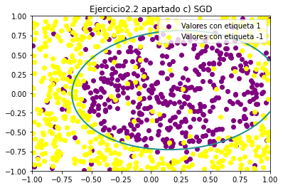
---------------------------------------------------------

Nuevamente, para validar los resultados realizo el mismo experimento con la pseudoinversa obteniendo:

~~~
Bondad del resultado para pseudoinversa:

Uso eta=0.1, error=1e-14 , max_iteraciones=200 y w inicializado a [1. ... 1. 1.]
w final:  [[-0.84240634]
 [-0.48348941]
 [-0.09179431]
 [-0.17884745]
 [ 1.17660546]
 [ 1.51303266]]
Ein:  0.5989154650667663
~~~

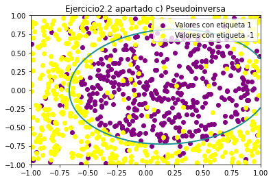
---------------------------------------------------------

Y nuevamente vemos que los resultados son prácticamente idénticos.

Finalmente si realizamos el experimento de las mil iteraciones obtendremos los siguientes resultados:

~~~
Tras mil iteraciones repitiendo el ejemplo anterior:

Ein medio:  0.5791197645316455
Eout medio:  0.5867079177511026
~~~

#### A la vista de los resultados de los errores promedios Ein y Eout obtenidos en los dos experimentos ¿Qué modelo considera que es el más adecuado? Justifique la decisión. 

Dados los resultados obtenidos considero que el modelo que mejor se ajusta a este problema es el segundo, con vector de características no lineales, pues con dicho modelo se obtiene un ajuste que tiene menor Error en el training set (0.9258693113953839 frente a  0.5791197645316455) y no ocurre overfitting, es decir, a pesar de que el modelo se ajusta muy bien en el training set, en el test set consigue mantener un error prácticamente idéntico y en ambos casos es un error aceptable. Por otra parte, con el vector de características original y el modelo de regresión lineal,como hemos comentado antes, tenemos un ejemplo de leve "underfitting", pues el modelo no es capaz de captar las variaciones de los datos correctamente, por ello cosidero que es más adecuado el segundo modelo.

## Ejercicio Bonus

#### Método de Newton. Implementar el algoritmo de minimización de Newton y aplicarlo a la función $f(x,y)$ dada en el ejercicio 3. Desarrolle los mismos experimentos usando los mismos puntos de inicio.

##### 1. Generar un gráfico de como desciende el valor de la función con las iteraciones. 

##### 2. Extraer conclusiones sobre las conductas de los algoritmos comparando la curva de decrecimiento de la función calculada en el apartado anterior y la correspondiente obtenida con gradiente descendente.

Igual que en el ejercicio 1.3 estamos considerando la función: 

$f(x,y)=2\sin\left(2{\pi}y\right)\sin\left(2{\pi}x\right)+\left(x+2\right)^2+2\left(y-2\right)^2$

Y dado que el método de Newton es el siguiente:

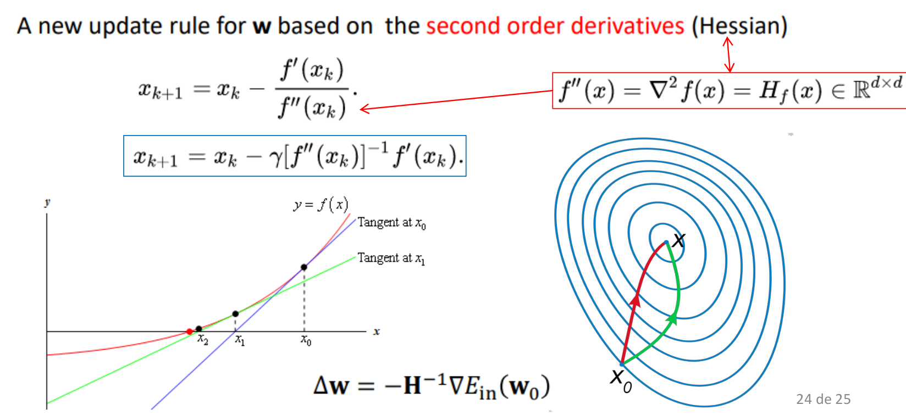
------------------------------------------------------------

Como podemos observar tenemos que calcular la matriz Hessiana de las segundas derivadas de $f(x,y)$:

$$Hess(f)=
\begin{bmatrix}
\frac {\partial^2} {\partial x^2} f(x,y) & \frac {\partial^2} {\partial x \partial y} f(x,y) \\
\frac {\partial^2} {\partial y \partial x} f(x,y)& \frac {\partial^2} {\partial y^2} f(x,y)
\end{bmatrix}
$$
Dónde 
$\frac {\partial^2} {\partial x^2}f(x,y) =2-8{\pi}^2\sin\left(2{\pi}y\right)\sin\left(2{\pi}x\right)$, 
$\frac {\partial^2} {\partial x \partial y} f(x,y)=8{\pi}^2\cos\left(2{\pi}x\right)\cos\left(2{\pi}y\right)$

$\frac {\partial^2} {\partial y \partial x} f(x,y)=8{\pi}^2\cos\left(2{\pi}y\right)\cos\left(2{\pi}x\right)$

$\frac {\partial^2} {\partial y^2} f(x,y)=4-8{\pi}^2\sin\left(2{\pi}x\right)\sin\left(2{\pi}y\right)$

Y reutilizando las funciones del ejercicio 1.3 sólo habría que implementar las siguientes funciones:

~~~py
################# Segundas derivadas 

def d2fdx2(x,y):
    return 2-8*np.pi**2*np.sin(2*np.pi*y)*np.sin(2*np.pi*x)

def d2fdxdy(x,y):
    return 8*np.pi**2*np.cos(2*np.pi*x)*np.cos(2*np.pi*y)

def d2fdydx(x,y):
    return 8*np.pi**2*np.cos(2*np.pi*x)*np.cos(2*np.pi*y)

def d2fdy2(x,y):
    return 4-8*np.pi**2*np.sin(2*np.pi*y)*np.sin(2*np.pi*x)

################# Matriz Hessiana de segundas derivadas 
def Hessianf(x,y):
    return np.array([[d2fdx2(x,y),d2fdxdy(x,y)],[d2fdydx(x,y),d2fdy2(x,y)]])
~~~

Finalmente, el algoritmo quedaría de la siguiente manera:

~~~py
def NewtonsMethod(w,eta,num_iterations):
    iterations=0
    vector_puntos=np.array([[w[0],w[1]]])
    while iterations<num_iterations:
        w=w-eta*np.linalg.inv(Hessianf(w[0],w[1])).dot(gradf(w[0],w[1]))
        iterations=iterations + 1 
        vector_puntos=np.append(vector_puntos, [[w[0],w[1]]], axis=0) #Voy guardando los puntos obtenidos en un array de numpy para luego hacer el gráfico
             
    return w, iterations, vector_puntos
~~~
En cada iteración actualizamos los valores de w restándoles a los de la iteración anterior el producto de la inversa de la matriz Hessiana de f evaluada en w por el gradiente evaluado en w. Este algoritmo se puede implementar con una tasa de aprendizaje eta, como he hecho yo y como se muestra en la fotografía del método ($\gamma$).

En primer lugar, para ver el comportamiento del método he probado con distintos valores de eta (0.01,0.1 y 1) empezando en el mismo punto que el ejercicio 1.3 (el (-1,1)), y estos han sido los resultados:

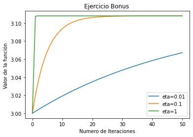

-----------------------------------------------------------------

Como podemos ver aquí se presenta la primera gran diferencia con respecto al método del gradiente descendente, en este caso la elección del eta no nos hace diverger u oscilar si el eta es muy elevado, simplemente nos hace converger más deprisa si la tasa de aprendizaje es elevada. 

Como segunda observación, vemos que el método no converge a 0 como en el caso del gradiente descendente para eta=0.01, sino que converge a 3.1079800610352017, y es que este método, por la manera en que funciona, puede quedar atrapado en "Puntos de silla" (superficies de pendiente 0 que no son extremos) cosa que en el gradiente Descendente no es tan frecuente, y dado que está función presenta muchos puntos de silla tiene un funcionamiento peor el algoritmo de Newton.

A partir de ahora usaremos eta=1 para el Método de Newton,ya que como hemos visto antes, esto solo acelera la convergencia y los datos serán más reveladores.

Hacemos ahora el experimento variando el punto de inicio y con 100 iteraciones:

--------------------------------------------------
|Newton|
|---|
|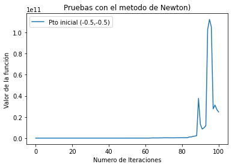|
|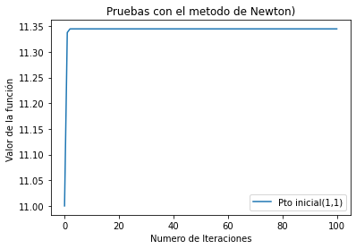|
|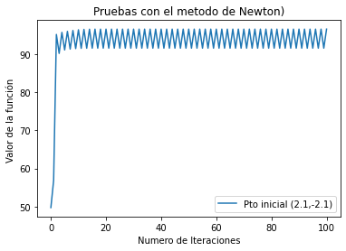|
|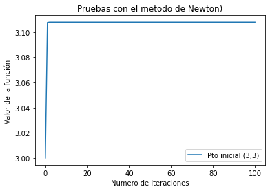|
|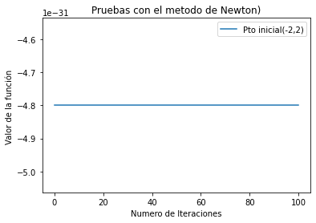|

Como podemos observar en los gráficos, la principal diferencia está en que el método de Newton no disminuye el valor de la función en ningún caso, puede ciclar (como el caso del punto (2.1,-2.1)), puede converger a mínimos locales o puntos de silla (como en el caso del punto (3,3)), puede no converger (como el caso del punto (-0.5,0.5)) o puede permanecer constante (como en el caso del punto (-2,2))y es que para que el método de Newton sea eficaz (que lo puede ser, y en ocasiones mejor que el gradiente descendente), la función que estamos considerando debe ser estrictamente convexa o al menos convexa (y la función que estamos considerando no lo es, pues presenta muchos 'picos' u 'hoyos' como habíamos comentado ya, por eso el método no funciona correctamente) y tomar un valor x0 lo suficientemente cercano al mínimo como para asegurar la convergencia. 

Luego como conclusión podemos observar que ,a diferencia del método del Gradiente Descendente el eta elegido, no parece influir en los resultados, pero en cambio ambos algoritmos mantienen una fuerte dependencia del punto incial tomado, por lo que seguiría siendo necesario un estudio de qué punto inicial tomar para lograr alcanzar un mínimo de la función. Por otra parte, este método funciona correctamente con funciones convexas o estrictamente convexas, por lo que está un poco limitado ya que este conjunto de funciones es muy pequeño. Y como comentario, se ha podido ver que este algoritmo puede parecer "peor" que el Gradiente Descendente, pero esto no es cierto, depende mucho del caso y la función, y este algoritmo en funciones convexas puede ser realmente rápido (más que el gradiente descendente) y en pocas iteraciones alcanzar el mínimo global de la función.

Finalmente mostramos los resultados numéricos obtenidos por el algoritmo de Newton en la siguiente tabla:

|Punto inicial| w obtenido | f(w)|
|--| -- | --|
|( -0.5 , -0.5 )|( -89088.47344610887 ,  91767.07849540607 )|24778059013.443085|
|( 1 , 1 )|( 1.067372638667162 ,  0.9100709200235607 )|11.344755748360596|
|( 2.1 , -2.1 )|( 3.82834646986596 ,  -3.6596191941880383 )|96.54631298064648|
|( -3 , 3 )|( -3.05397555493864 ,  3.028461459660191 )|3.1079800610352026|
|( -2 , 2 )|( -2.0 ,  2.0 )|-4.799231304517944e-31|

Como último comentario, todo el código para representar las gráficas es reutilizado de ejercicios anteriores, y por lo tanto ya ha sido explicado.

