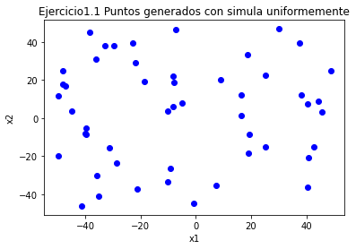
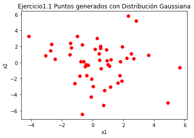
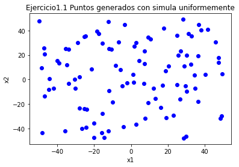
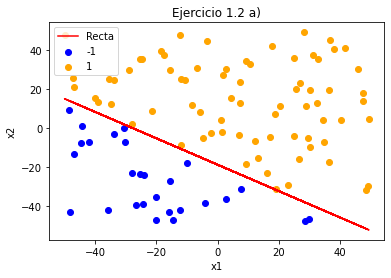
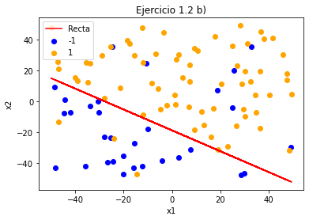
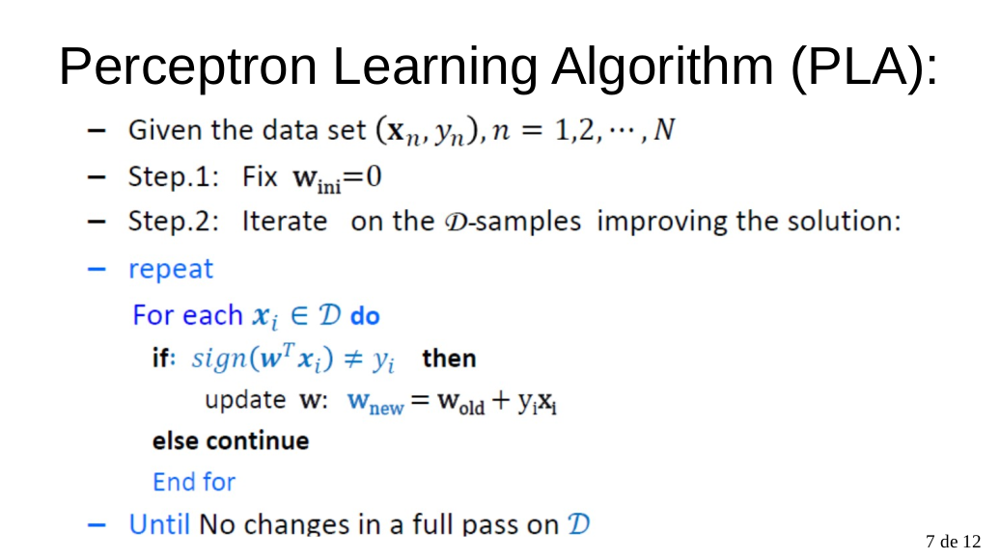
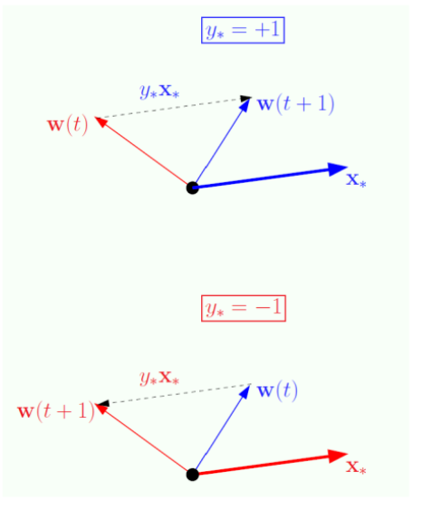
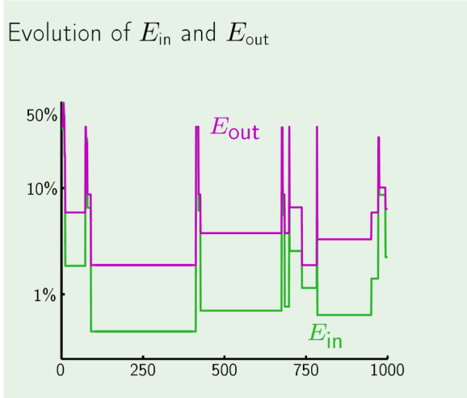
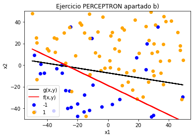
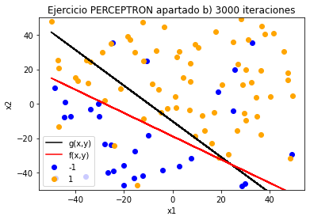

# 1. Complejidad de $\mathcal{H}$ y ruido
## Ejercicio 1.1 

**Dibujar gráficas con las nubes de puntos simuladas con las siguientes condiciones**

- **Considere N=50, dim=2, rango=[-50,50] con simula_unif(N,dim,rango).**

- **Considere N=50, dim=2, sigma=[5,7] con simula_gaus(N,dim,sigma).**

En este primer ejercicio vamos a probar las funciones que se nos proporcionan en el template para generar nubes de puntos:

En primer lugar, genero con ayuda de la función simula_unif(50,2,[-50,50]) una nube de 50 puntos en 2 dimensiones que toman valores en el intervalo [-50,50] en cada componente y qu que siguen una distribución uniforme de probabilidad, el código sería el siguiente: 

~~~py
x = simula_unif(50, 2, [-50,50])
# Dibujo el Scatter Plot de los puntos generados
plt.scatter(x[:,0],x[:,1], c='blue')
plt.title('Ejercicio1.1 Puntos generados con simula uniformemente')
plt.xlabel('x1')
plt.ylabel('x2')
plt.show()
~~~

La matriz x contiene los valores de la primera y segunda coordenada de cada punto y con la función scatter de matplotlib.pyplot representamos la nube de puntos, que quedaría así:

---------------------------------------------------------------

---------------------------------------------------------------

En segundo lugar, genero con ayuda de la función simula_gaus(50,2,[5,7]) una nube de 50 puntos en 2 dimensiones que siguen una distribución Normal de parámetros N(0,5) en el eje x y N(0,7) en el eje y, el código sería el siguiente:

~~~ py
x = simula_gaus(50, 2, np.array([5,7]))
# Dibujo el Scatter Plot de los puntos generados
plt.scatter(x[:,0],x[:,1], c='red')
plt.title('Ejercicio1.1 Puntos generados con Distribución Gaussiana')
plt.xlabel('x1')
plt.ylabel('x2')
plt.show()
~~~

Y el gráfico generado es:

---------------------------------------------------------------

---------------------------------------------------------------

## Ejercicio 1.2 

**Vamos a valorar la influencia del ruido en la selección de la complejidad de la clase de funciones. Con ayuda de la función simula_unif(100,2,[-50,50]) generamos una muestra de puntos 2D a los que vamos a añadir una etiqueta usando el signo de la función $f(x,y)=y-ax-b$, es decir, el signo de la distancia de cada punto a la recta simulada con simula_recta()**

- **Dibujar un grafico 2D donde los puntos muestren (usen colores) el resultado de su etiqueta. Dibuje también la recta usada para etiquetar. (observe que todos los puntos están bien clasificados respecto de la recta)**

En este apartado vamos a generar de nuevo una nube de puntos en 2 dimensiones que siguen una distribución Normal, pero en este caso, usaremos un hiperplano (una recta pues estamos en 2D) para dar una etiqueta a cada punto del espacio, si un punto se sitúa por encima de la recta, al evaluar dicho punto en $f(x,y)$ obtendrá un valor positivo, y la función signo le pondrá como etiqueta +1, en cambio si el punto se sitúa por debajo de la recta, en este caso se le asigna el valor -1.

Para obtener los coeficientes a, b de la recta $f(x,y)=y-ax-b$ usaremos la función simula_recta([-50,50]) que se nos proporciona en el template, y pasamos como parámetro el intervalo de defincición, en este caso [-50,50]. Finalmente, representamos en un gráfico la recta junto con los puntos clasificados. El código sería el siguiente:

~~~ py
#Calculamos los coeficientes de la recta
a,b=simula_recta([-50,50])

#Generamos las etiquetas
y=[]

for i in x :
    y.append(f(i[0],i[1],a,b))

y=np.array(y)
y0 = np.where(y == -1) #capturo los índices de los elementos con -1
y1 = np.where(y == 1) #capturo los índices de los elementos con 1
#x_2 contiene dos arrays, uno en cada componente, el primero tiene los valores de x con etiqueta -1 y la segunda los de etiqueta 1
x_2 = np.array([x[y0[0]],x[y1[0]]])
plt.scatter(x_2[0][:, 0], x_2[0][:, 1],  c = 'blue', label = '-1') #Dibujamos los puntos con etiqueta 1
plt.scatter(x_2[1][:, 0], x_2[1][:, 1],  c = 'orange', label = '1')#Dibujamos los de etiqueta -1

#Calculamos las imagenes de los puntos (sin aplicar la función signo) y así dibujar la recta de regresión
imagenes=[]

for i in x :
    imagenes.append(a*i[0]+b)
    
plt.plot( x[:,0], imagenes, c = 'red', label='Recta') #Para representarlo, despejo x2 de la ecuación y represento la función resultante en 2D
plt.legend()
plt.title("Ejercicio 1.2 a)")
plt.xlabel('x1')
plt.ylabel('x2')
plt.figure()
plt.show()
~~~

En primer lugar, como hemos dicho obtenemos los coeficientes de la recta, y después obtenemos las etiquetas para cada punto de la matriz x (matriz de los 100 puntos obtenidos por simula_unif()), en segundo lugar pintamos por separado los puntos clasificados con +1 y -1 usando el color naranja para los primeros y azul para los segundos. Finalmente dibujo la gráfica de la recta y represento todos los datos juntos en un gráfico. Finalmente comentar que la forma en que represento los datos es la misma que en la práctica pasada y por tanto ya se explicó en la práctica anterior cómo se realizaba.

A continuación muestro los gráficos correspondientes a este apartado:

---------------------------------------------------------------------

---------------------------------------------------------------------

---------------------------------------------------------------------

---------------------------------------------------------------------

Como comentario final, por la forma en que hemos procedido, el error de clasificación cometido por esta recta será de 0, ya que hemos usado esta recta para clasificar los datos.

- **Modifique de forma aleatoria un 10% de las etiquetas positivas y otro 10% de las etiquetas negativas y guarde los puntos con sus nuevas etiquetas. Dibuje de nuevo la gráfica anterior. (Ahora habrá puntos mal clasificados respecto de la recta)**

En este apartado convertimos el vector $y_0$ de índices que nos indicaba las posiciones de las etiquetas con valor -1 en el vector $y$ (vector de etiquetas) en un DataFrame de Pandas, ya que esta librería nos permite con facilidad obtener el 10% de los índices y cambiar el valor de su etiqueta. Después hacemos lo mismo con el vector $y_1$.

A continuación muestro el código:

~~~ py
### Como en el apartado siguiente vamos a calcular la accuracy del clasificador (TP+TN)/(P+N) capturo los TP y TN de este método ya que (P+N)=100
TN=len(y0[0]) #Numero de etiquetas con -1, pues antes de meter ruido la recta clasifica perfectamente
TP=len(y1[0]) #Numero de etiquetas con +1, pues antes de meter ruido la recta clasifica perfectamente

# Array con 10% de indices aleatorios para introducir ruido
y0=pd.DataFrame(data=y0[0]); #Convierto la matriz X en un Dataframe de Pandas, que es más cómodo de usar 
y0=y0.sample(frac=0.10,random_state=1); #Hacemos que tome un 10% de los datos de forma aleatoria
y0=y0.to_numpy()
for i in y0:
    y[i]=1
    
TN=TN-len(y0); #Como hemos etiquetado "mal" el 10% de los elementos pues actualizamos los TN
~~~

Como comentarios al código, en primer lugar las variables TN y TP hacen referencia a los "True negatives" y "True positives", es decir, aquellos puntos cuya etiqueta real coincide con la etiqueta de la función que estamos usando como clasificador. En este caso, antes de modificar las etiquetas, por lo comentado en el apartado anterior, la recta clasifica perfectamente los datos, es por eso que los TP coinciden con los "Positives" de la muestra y los TN coinciden con los "Negatives" de la muestra, y al actualizar el 10% de las etiquetas , estos puntos pasarán automáticamente a estar mal clasificados por la recta y se debe restar el número de puntos elegido al valor de TP y TN que teníamos al principio. Esto se utilizará en el apartado siguiente, dónde compararemos la precisión (Accuracy) de distintas funciones al utilizarlas como clasificadores.

Finalmente comentar que el código es análogo para las etiquetas con +1.

Tras esta modificación, el gráfico queda de la siguiente forma:

--------------------------------------------------------

--------------------------------------------------------

- **Supongamos ahora que las siguientes funciones definen la frontera de clasificación de los puntos de la muestra en lugar de la recta. Visualizar el etiquetado generado en 2b) junto con cada una de las gráficas de cada una de las funciones. Compara las regiones positivas y negativas de estas nuevas funciones con las obtenidas en el caso de la recta. Argumente si estas funciones más complejas son mejores clasificadores que la función lineal. Observe las gráficas y diga que consecuencias extrae sobre la influencia del proceso de modificación de etiquetas en el proceso de aprendizaje. Explicar el razonamiento.** 
    - $f(x,y)=(x-10)^2 + (y-20)^2 -400$ 
    - $f(x,y)=0.5(x-10)^2 + (y-20)^2 -400$ 
    - $f(x,y)=0.5(x-10)^2 - (y+20)^2 -400$ 
    - $f(x,y)=y -20x^2 -5x +3$ 

Este apartado es el más interesante, pues vamos a comparar el clasificador obtenido en los apartados anteriores (recordemos, la recta $f(x,y)=y-ax-b$) con otras funciones que definen distintas fronteras de decisión.

En primer lugar aclarar como ya se comentó en el apartado anterior que para comparar las distintas funciones usaremos la precisión o accuracy ($\frac{TN+TP}{P+N}$) que nos proporciona el porcentaje de puntos bien clasificados por cada función. De hecho comenzamos calculando la precisión de la recta del apartado anterior, que tiene una precisión de 0.9. Tiene lógica que salga tan buena precisión pues es la función que hemos usado para clasificar la nube de puntos y después hemos metido un 10% de ruido a sus etiquetas positivas y negativas, por lo que no debía bajar mucho la precisión del 100%.

Dicho esto, realizaré una explicación del código usado para la primera función pues para el resto es completamente análogo: 

~~~py
def f1(x):
    y=[]
    for i in x:
        y.append((i[0]-10)**2 + (i[1]-20)**2-400)
    
    return np.asarray(y)

plot_datos_cuad(x,y,f1,'Frontera de decision con función 1', 'x1', 'x2')

imagenes=f1(x) #Capturo las imágenes de cada punto
TN=0
TP=0
cont=0

for i in imagenes:
    
    if i>0 and y[cont]>0: #Si tienen la misma etiqueta +1 
        TP+=1
    if i<0 and y[cont]<0: #Si tienen la misma etiqueta -1 
        TN+=1
    cont+=1
    
print("Mostramos la accuracy del método f1")
print ("ACCURACY= ", (TN+TP)/100.0)

~~~

En primer lugar definimos la función que vamos a usar para definir la frontera de decisión. Como comentario, para poder hacer uso posteriormente de la función plot_datos_cuad() que se nos proporciona en el template debemos definir la función de manera que dada la matriz de datos x, nos devuelva directamente el vector y de imágenes.

En segundo lugar, haciendo uso de la función anteriormente mencionada representamos las regiones de puntos con etiqueta +1 y -1 y los puntos del apartado anterior (así veremos visualmente si nuestro clasificador es bueno o no). Dicho gráfico es el siguiente:

-----------------------------------------------------------------------

-----------------------------------------------------------------------

La región azul representa la región de puntos con etiqueta +1 según nuestro nuevo clasificador y la región burdeos la región de puntos con etiqueta -1. 

Finalmente, en la útlima parte del código calculamos los TP y TN de nuestra nueva función. Para ello, usando el vector de imágenes generado por la nueva función, vemos en que puntos coincide el signo del punto con el de la etiqueta, y cuando hacemos fracción nos da el siguiente resultado:

~~~
Mostramos la precisión del método del apartado anterior
ACCURACY=  0.9
Mostramos la accuracy del método f1
ACCURACY=  0.59

~~~

Como podemos observar, la nueva función no clasifica tan bien los datos como la del apartado anterior, y hacierta tan solo en un 59% de las etiquetas, luego esto no lleva a pensar que si dicha función no representa una frontera de decisión que explique correctamente la muestra. A pesar de esto se puede pensar que la precisión tampoco es tan baja, dado que el área donde la función asigna etiqueta +1 es tan grande que engloba muchos puntos (que clasifica tanto bien como mal), y además en la región -1 ha dado la casualidad de que caen algunos de los puntos alterados, lo cual hace que los clasifique como correctos también. Pero claro, estas conclusiones las hemos sacado visualizando el gráfico, pues solo con los datos podríamos haber pensado que quizá no era tan mal clasificador.

En las siguientes funciones procedemos de forma análoga.

Para la función $f(x,y)=0.5(x-10)^2 + (y-20)^2 -400$ obtenemos los siguientes resultados:

----------------------------------------------------------------------

----------------------------------------------------------------------

~~~
Mostramos la precisión del método del apartado anterior
ACCURACY=  0.9
Mostramos la accuracy del método f2
ACCURACY=  0.51
~~~

Como podemos observar, en este caso pasa algo similar al anterior, la precisión comparada con la recta empeora bastante, y el porcentaje de aciertos que tiene se debe a lo mismo que pasaba en el apartado anterior, luego la conclusión es que tampoco es una buena función para definir la frontera de decisión.

Para $f(x,y)=0.5(x-10)^2 - (y+20)^2 -400$ obtenemos los siguientes resultados:

----------------------------------------------------------------------

----------------------------------------------------------------------

~~~
Mostramos la precisión del método del apartado anterior
ACCURACY=  0.9
Mostramos la accuracy del método f3
ACCURACY=  0.22
~~~

Claramente esta función no explica la muestra, el porcentaje de acierto es de un 22% frnte al 90% de la recta y por la gráfica se da a entender que los puntos correctamente clasificados han sido por suerte. Luego como conclusión no es una función correcta para gneralizar y para definir la frontera de decisión.

Finalmente para $f(x,y)=y -20x^2 -5x +3$  obtenemos los siguientes resultados:

----------------------------------------------------------------------

----------------------------------------------------------------------

~~~
Mostramos la precisión del método del apartado anterior
ACCURACY=  0.9
Mostramos la accuracy del método f4
ACCURACY=  0.31
~~~

De nuevo nos encontramos ante un mal clasificador para nuestra frontera de decisión, las regiones de +1 y -1 no se ajustan a los datos y las coincidencias se deben a que la región -1 es muy amplia y engloba a todos los datos con etiqueta -1, pero como también engloba a los de etiqueta +1 pues se comete un error muy alto.

Por lo tanto, la conclusión que podemos sacar sobre la influencia del ruido en la muestra y las funciones de $\mathcal{H}$ que valoremos es que puede influir positiva o negativamente en las funciones provocando que algunos clasificadores que a priori no explican en absoluto la muestra cometan un porcentaje de acierto mayor de lo esperado o que buenos clasificadores como la recta del apartado anterior cometan un error mayor del esperado. 

Por otro lado, como hemos podido comprobar en este ejemplo, añadir funciones de una mayor complejidad para valorarlas como posibles clasificadores no es siempre sinónimo de que vamos a obtener mejores resultados que con otras funciones más simples. De hecho para esta muestra concreta una recta nos proporciona un porcentaje de acierto muy superor al de cualquier otra función. 

Finalmente comentar que es preferible en este tipo de situaciones estudiar un poco más la muestra, representar los puntos gráficamente si se puede y valorar que funciones pueden ajustarse mejor a la muestra antes que tomar un conjunto muy grande de funciones complejas y probarlas.

# Modelos Lineales

## Ejercicio 2.1 PLA

**Implementar la función ajusta_PLA(datos,label,max_iter,vini) que calcula el algoritmo PLA.**

El Perceptrón es un algoritmo empleado generalmente en problemas de clasificación binaria en el cual tratamos de separar con un hiperplano una serie de puntos con etiquetas distintas (en nuestro caso +1 y -1), dicho esto el algoritmo sería el siguiente: 

------------------------------------------------------------

------------------------------------------------------------

Como podemos ver, comienza inicializando el vector de pesos (los coeficientes de nuestro hiperplano) a cero. Tras esto se va iterando sobre los elementos de la muestra ($\mathcal{D}$) de manera que si el signo de evaluar el punto en el hiperplano actual (valor de los coeficientes en ese momento) es distinto a la etiqueta real del punto, lo que hacemos es actualizar el valor de los pesos de manera que el nuevo hiperplano clasifique bien este punto, geométricamente, lo que estamos haciendo es lo siguiente:

------------------------------------------------------------

------------------------------------------------------------

Como podemos ver, si en la iteración t, el vector de pesos w(t) clasificaba erróneamente el punto, la diferencia w(t)- $y_ix_i$  gira el hiperplano clasificando correctamente el punto. Y si el punto estaba bien clasificado entonces no se actualiza el vector de pesos.

Este proceso se repite hasta que el algoritmo da una vuelta sobre todos los puntos y no encuentra puntos mal clasificados.

Es importante tener en cuenta que este algoritmo para en el caso de que el conjunto de puntos sea linealmente separable, en otro caso el algoritmo cicla indefinidamente por lo que se suele añadir un criterio de parada extra que es un máximo de iteraciones. No obstante conviene saber que en este algoritmo, si los datos no son linealmente separables más iteraciones no es sinónimo de mejor comportamiento, hay que pensar que con cada cambio en el vector de pesos se clasifica correctamente el punto deseado pero a costa de clasificar mal otros puntos quizás. De hecho la gráfica del error cometido con este algoritmo nos lo muestra: 

------------------------------------------------------------

------------------------------------------------------------

Dicho esto, el algoritmo implementado es el siguiente:

~~~py
def ajusta_PLA(datos, label, max_iter, vini):
    '''
    Algoritmo Perceptrón
    Parameters
    ----------
    datos : Matriz de datos
    
    label : Vector de etiquetas
    
    max_iter : número máximo de iteraciones
    
    vini : vector inicial de pesos

    Returns
    -------
    w : vector de pesos.
    
    it : número de iteraciones empleadas

    '''
    mejora=True
    it=0
    w=np.array(vini)
    w=w.reshape(-1,1) #Lo transformo en un vector columna
    
    while (mejora and it<max_iter): # 
        mejora=False
        it+=1
        for i in range(len(datos)):
            valor=datos[i,:].dot(w)
            sign=signo(valor.item())

            if sign!=label[i]:
                actualiza=label[i]*datos[i,:]
                actualiza=np.array(actualiza)
                actualiza=actualiza.reshape(-1,1)
                w=w+actualiza
                mejora=True
    
            
        
                
    return w, it  
~~~

El booleano *mejora* controla si en una pasada sobre los datos se actualiza el vector de pesos o no y en caso de que no se haya "mejorado" el algoritmo en una pasada, se sale del bucle principal y acaba el algoritmo.

La variable it controla el número de iteraciones y junto con el vector de pesos se devuelve al final.

Finalmente w es el vector de pesos (inicializado al valor que se pase en la variable vini).

**Ejecutar el algoritmo PLA con los datos simulados en los apartados 2a de la sección 1. Inicializar el algoritmo con: a) el vector cero y, b) vectores de números aleatorios en [0,1] (10 veces). Anotar el número medio de iteraciones necesarias en ambos casos para converger. Valorar el resultado relacionando el punto de inicio con el número de iteraciones**

Ahora vamos a poner en funcionamiento el algoritmo implementado y vamos a ver cómo se comporta. En primer lugar lo hacemos con una muestra de datos separable (lo que nos garantiza convergencia en un número finito de iteraciones) y con el vector de pesos inicializado a 0. El código sería el siguiente: 

~~~py
vini=[0.0,0.0,0.0]
unos=np.ones((x.shape[0],1))
x=np.concatenate((unos,x),axis=1)
w, iteraciones=ajusta_PLA(x,labels,1000,vini)
~~~

Con esto, los resultados obtenidos son los siguientes:

------------------------------------------------------------

------------------------------------------------------------

Y el número de iteraciones empleado es **75** lo cual nos indica un buen comportamiento del algoritmo para la muestra.

Si repetimos el experimento diez veces, pero esta vez inicializando el algoritmo con un vector de pesos aleatorios en el intervalo  [0,1]. Los resultados obtenidos son los siguientes:

~~~
Iteracion:  0
vector inicial=  [0.61851357 0.01036426 0.53862728]
vector obtenido=  [[555.61851357]
 [ 19.40133558]
 [ 29.25372607]]
Iteraciones:  60

Iteracion:  1
vector inicial=  [0.00301796 0.95119379 0.90540203]
vector obtenido=  [[1118.00301796]
 [  39.14140853]
 [  59.61274055]]
Iteraciones:  248

Iteracion:  2
vector inicial=  [0.79596694 0.91527432 0.14555823]
vector obtenido=  [[458.79596694]
 [ 15.33193632]
 [ 23.83811624]]
Iteraciones:  43

Iteracion:  3
vector inicial=  [0.15773007 0.18763167 0.6224959 ]
vector obtenido=  [[609.15773007]
 [ 24.12447153]
 [ 33.26034218]]
Iteraciones:  72

Iteracion:  4
vector inicial=  [0.9058095  0.98995518 0.71112246]
vector obtenido=  [[831.9058095 ]
 [ 32.42230954]
 [ 46.4541019 ]]
Iteraciones:  129

Iteracion:  5
vector inicial=  [0.73180041 0.9092932  0.40087373]
vector obtenido=  [[1087.73180041]
 [  39.49082489]
 [  53.52108012]]
Iteraciones:  244

Iteracion:  6
vector inicial=  [0.24985068 0.17343017 0.11945705]
vector obtenido=  [[641.24985068]
 [ 22.45196541]
 [ 30.99115595]]
Iteraciones:  70

Iteracion:  7
vector inicial=  [0.81261059 0.14679237 0.26429748]
vector obtenido=  [[663.81261059]
 [ 22.1176698 ]
 [ 30.86402695]]
Iteraciones:  84

Iteracion:  8
vector inicial=  [0.81908918 0.31058725 0.98241745]
vector obtenido=  [[826.81908918]
 [ 31.22040887]
 [ 45.12679496]]
Iteraciones:  122

Iteracion:  9
vector inicial=  [0.2666387  0.53365334 0.31446701]
vector obtenido=  [[383.2666387 ]
 [ 14.43198212]
 [ 17.53050619]]
Iteraciones:  37

Valor medio de iteraciones necesario para converger con 10 vectores random:  110.9
~~~

En este caso el número medio de iteraciones es de 110.9, superior al obtenido con el vector inicializado a 0. Esto nos lleva a pensar que existe una relación entre el vector inicial de pesos y el número de iteraciones empleadas por el algoritmo. El problema es que a priori no sabemos con qué vector es mejor inicializar el algoritmo pues tenemos resultados muy dispares como podemos ver, es por eso que se suele optar por inicializar el vector de pesos a 0.

**Hacer lo mismo pero con el etiquetado del *2b* de la sección 1. ¿Observa algún comportamiento diferente? En caso afirmativo diga cual y las razones para que ello ocurra.**

En este caso, la muestra tiene ruido, y por lo tanto no es linealmente separable, es por ello que el algoritmo PLA no convergerá. Veámoslo:

Si inicializamos el vector de pesos a 0 obtenemos el siguiente resultado para PLA:

------------------------------------------------------------

------------------------------------------------------------

En este caso, el algoritmo ha finalizado porque ha llegado al número de iteraciones máximas permitidas (1000 en nuestro caso), y como podemos ver, la recta obtenida no se ajusta a los datos tan bien como la obtenida en el apartado anterior. Como ya se comentó anteriormente, el aumento del número de iteraciones no significa que obtendríamos un resultado mejor, de hecho para 3000 iteraciones el resultado es el siguiente: 

------------------------------------------------------------

------------------------------------------------------------

Que como podemos observar sigue alejado de la función $f(x,y)$ que buscábamos.

Si ahora repetimos el experimento 10 veces con vector inicial aleatorio, obtenemos los siguientes resultados:

~~~
Iteracion:  0
vector inicial=  [0.91077283 0.36655664 0.43359233]
vector obtenido=  [[362.91077283]
 [ 20.10049452]
 [  9.08648493]]
Iteraciones:  1000

Iteracion:  1
vector inicial=  [0.51229269 0.93888648 0.03094901]
vector obtenido=  [[354.51229269]
 [ 20.8787443 ]
 [  7.98916437]]
Iteraciones:  1000

Iteracion:  2
vector inicial=  [0.71687866 0.89101895 0.02728722]
vector obtenido=  [[344.71687866]
 [ 10.04335853]
 [ 46.7802725 ]]
Iteraciones:  1000

Iteracion:  3
vector inicial=  [0.52205125 0.32598981 0.85948932]
vector obtenido=  [[359.52205125]
 [ 26.83227944]
 [ 18.26746968]]
Iteraciones:  1000

Iteracion:  4
vector inicial=  [0.55851655 0.69022787 0.4528535 ]
vector obtenido=  [[348.55851655]
 [ 34.87790248]
 [ 26.09851797]]
Iteraciones:  1000

Iteracion:  5
vector inicial=  [0.62830904 0.29009685 0.00934858]
vector obtenido=  [[347.62830904]
 [ 34.91414172]
 [ 34.56543139]]
Iteraciones:  1000

Iteracion:  6
vector inicial=  [0.57675593 0.31144421 0.5172676 ]
vector obtenido=  [[360.57675593]
 [ 28.60358562]
 [ 27.45930253]]
Iteraciones:  1000

Iteracion:  7
vector inicial=  [0.91640585 0.42647479 0.24739604]
vector obtenido=  [[341.91640585]
 [ 30.8084188 ]
 [ 19.11802008]]
Iteraciones:  1000

Iteracion:  8
vector inicial=  [0.37129376 0.93186112 0.93686838]
vector obtenido=  [[351.37129376]
 [ 10.4227821 ]
 [ 44.05950166]]
Iteraciones:  1000

Iteracion:  9
vector inicial=  [0.84432995 0.92020651 0.22790029]
vector obtenido=  [[341.84432995]
 [ 23.05147752]
 [ 16.79699087]]
Iteraciones:  1000

Valor medio de iteraciones necesario para converger con 10 vectores random:  1000.0
~~~

Como es de esperar, en todos y cada uno de los casos, el algoritmo consume las 1000 iteraciones máximas (pues la muestra no es linealmente separable). Y en este caso el punto inicial no influye, o al menos no de la misma forma que en el apartado anterior.

Luego las conclusiones que podemos sacar una vez realizado el ejercicio serían las siguientes: 

El algoritmo funciona muy bien en muestras linealmente separables, aunque si la muestra es muy grande puede ser un algoritmo lento, pero al menos garantiza una solución que separa perfectamente los elementos de la muestra. En cambio, como se ha visto en teoría, la mayoría de casos reales presentan conjuntos de entrenamiento con ruidol, lo cual hace que en la mayoría de ocasiones el algoritmo no pueda converger a una solución. Es por ello que puede ser una buena idea elegir un máximo de iteraciones a realizar (en nuestro caso hemos elegido 1000), así se reduce el tiempo de ejecución y se pueden llegar a soluciones razonables. No obstante como ya hemos comentado el error cometido por el hiperplano no es decreciente en cada iteración, por lo que elegir un número máximo de iteraciones no es sinónimo de éxito en este tipo de problemas. Ante esta problemática se crea el algoritmo PLA Pocket, cuya diferencia con el PLA es que tras actualizar los pesos, se comprueba si esta actualización tiene una mejora del Ein sobre la totalidad de los datos de la muestra, y solo se actualizan si los nuevos coeficientes mejoran el error. Esto nos asegura que el Error cometido desciende en cada iteración y por lo tanto tiene más sentido elegir un mayor número de iteraciones para el algoritmo, pues esto daría más oportunidades de mejorar los coeficientes (cuantas más iteraciones más actualizaciones de w).

