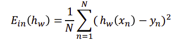
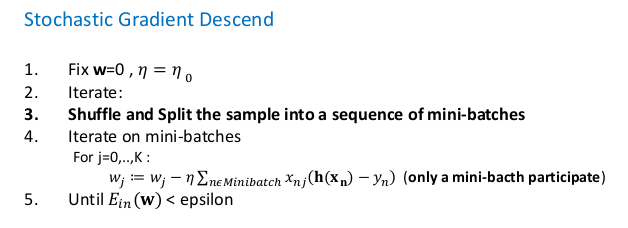
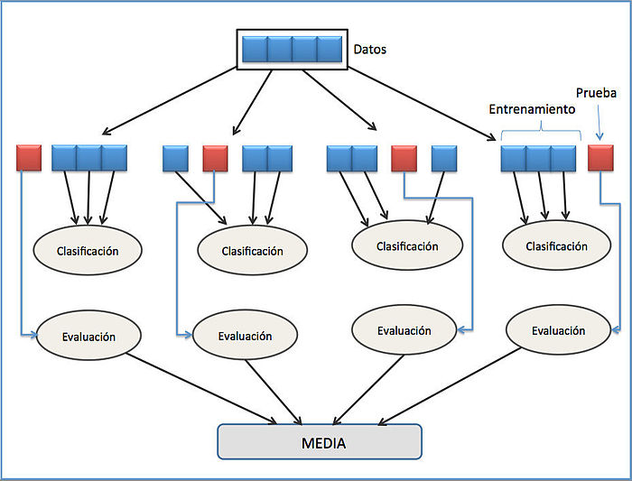
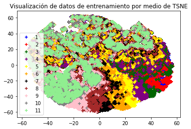
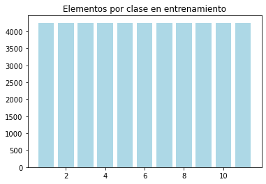

# Ajuste de Modelos Lineales

Vamos a tratar de resolver con técnicas de Machine Learning usando modelos lineales dos supuestos prácticos. Uno de ellos se resolverá usando Regresión y el otro usando Clasificación.

## Regresion
### 1.Problema

**Comprender el problema a resolver. Identificar los elementos X, Y, $f$ del problema y describirlos en detalle**

Usaremos la base de datos "Superconductividad" del siguiente enlace: https://archive.ics.uci.edu/ml/datasets/Superconductivty+Data

En dicho enlace vemos que no hay mucha información del problema, pero te redirecciona al siguiente enlace, donde sí que se explica el problema que vamos a tratar: https://www.sciencedirect.com/science/article/abs/pii/S0927025618304877?via%3Dihub 

Aquí podemos ver que se pretende estimar por medio de regresión la temperatura crítica superconductora en función de las características extraidas de la fórmula química del superconductor. Por lo tanto, esto no permite diferenciar los elementos del problema: 

- Por un lado $\mathcal{X}$ será la matriz de características, dónde en cada columna medimos una de las características de la fórmula química del superconductor. En total tenemos 81 características. Se nos proporciona una matriz de 21263x81.
  
- Por otra parte $\mathcal{Y}$ (nuestro vector de etiquetas) contiene las temperaturas para cada uno de los superconductores en los que hemos medido las 81 características. En nuestro caso, el vector $\mathcal{Y}$  viene pegado a la matriz $\mathcal{X}$, por lo que para manipularlo tendremos que separarlo.

- Finalmente la función que pretendemos estimar, y que es desconocida sería $f:\mathcal{X}\to\mathcal{Y}$ que nos asocia para cada vector de características una etiqueta.

### 2.Obtención
Una vez nos descargamos los datos de la base de datos mencionada en el apartado anterior, los metemos en nuestro directorio de trabajo en una carpeta llamada "datos", de manera que en nuestro código definiremos las siguientes variables para acceder a dichos ficheros: 

~~~py
#En el Fichero Regresion.py
NOMBRE_FICHERO_REGRESION = './datos/train.csv'

~~~

Después leemos los datos y los separamos en los conjuntos de Entrenamiento y Test (función LeerDatos) dejando un 80% de los datos en Entrenamiento y el 20% restante en Test (esta proporción de división es la más empleada y la que mejor resultados suele dar). Desde este momento en adelante no miraremos en ningún momento los datos de Test y todas las transformaciones que hagamos será en el conjunto de Entrenamiento, así evitaremos cometer "Data Snooping".

En el caso de Regresión, al tener una gran dimensionalidad los datos ($\mathbb{R}^{81}$), vamos a optar por no visualizar el conjunto de entrenamiento y simplemente haremos un estudio de las correlaciones existentes entre los datos en la posterior etapa de preprocesado.

### 3.Clase de funciones a usar 

A continuación, tal y como se ha visto en Teoría, una vez comprendido el problema vamos a establecer la clase $\mathcal{H}$ de funciones que usaremos en nuestro modelo para estimar $f$.

Para el caso de regresión, dado que siempre vamos a tratar de elegir la clase $\mathcal{H}$ más simple posible (de acuerdo al principio de la Navaja de Okham) vamos a establecer la clase de combinaciones lineales con las características, de manera que la hipótesis que obtengamos tenga la forma: 
$$g(x)=w^{T}x$$

Es decir, nuestra clase $\mathcal{H}$ será el conjunto de todos los hiperplanos de $\mathbb{R}^{81}$, de manera que nuestro problema se reducirá a encontrar el vector de pesos $w$ empleando SGD (Gradiente Descendente estocástico). 

Tampoco he optado por una reducción de la dimensionalidad, ya que 81 atributos no me han parecido excesivos y lo que voy a intentar hacer es ajustar usando regularización para que aquellos atributos que tengan más importancia sean los que determinen el hiperplano en su gran mayoría.

### 4. Identificar las hipótesis finales que usará.
Una vez tenemos la clase de funciones H, utilizaremos *Validación Crizada* (Cross-Validation) para estimar los mejores parámetros para calcular nuestro mejor hiperplano (esto se explicará con detenimiento en el apartado 7). De esta forma hemos obtenido que la mejor hipótesis usando Regresión Lineal con Gradiente Descendente Estocástico es : 

~~~
Tiempo empleado para validación cruzada: 172.45s

El mejor modelo es:  Pipeline(steps=[('scaler', StandardScaler()),
                ('sgdregressor',
                 SGDRegressor(alpha=0.001, learning_rate='adaptive',
                              max_iter=5000, penalty='l1'))])
E_in calculado en cross-validation:  310.05196214615836
Error cuadratico medio en test:  318.4457322822056
~~~

Como Podemos observar, los modelos que he considerado son un Pipeline de sklearn, que son cauces que sklearn permite hacer con distintas transformaciones sobre los datos con un estimador final, en mi caso como para la obtención de pesos usamos el Gradiente Descendente Estocástico que es sensible al ecalado de las distintas características nuestro modelo se compone de una Estandarización de los datos y una posterior regresión lineal haciendo uso del Gradiente Descendente Estocástico. Tanto la estandarización como la función SGDRegressor serán explicadas en etapas posteriores.

Como podemos observar por los resultados obtenidos en Validación Cruzada y en el conjunto de Test, la distancia al cuadrado promedio de los puntos al hiperplano de regresión es muy elevado, lo que nos hace pensar que nuestro modelo no es capaz de explicar correctamente el conjunto de entrenamiento y por tanto tampoco el de test. En mi opinión estamos ante un caso de Underfitting, y por lo tanto no sería mala idea considerar otros modelos para resolver el problema. Más adelante propongo algunas alternativas. 

### 5. Partición en Training y Test

En el fichero venían los datos de entrenamiento y test unidos, es por ello que no hemos tenido que juntar datos para luego separarlos. 

Para dividir el dataset en Entrenamiento y Test usamos la función de sklearn.model_selection llamada  train_test_split de la siguiente forma:

~~~py
x_entrenamiento, x_test, y_entrenamiento, y_test = train_test_split(x,
 y, test_size = 0.2, random_state = 1)
~~~

Como podemos observar nos devuelve el conjunto de entrenamiento y test con sus respectivas etiquetas y los parámetros a utilizar son, el conjunto x de características, el vector y de datos, la fracción de datos que usaremos como test (usamos un 20% pues es lo más habitual) y usamos una semilla para que al repetir el experimeto en una máquina diferente se produzcan los mismos resultados.

### 6. Preprocesado de datos

En el caso de Regresión, dado que vamos a usar el gradiente descendente estocástico para la obtención del vector de pesos $w$, sabemos que este método es sensible al escalado de características (las características con valores más altos tienen más peso para el algoritmo)  y como podemos observar en la matriz de características $X$ del conjunto de entrenamiento, las distintas columnas toman valores en unos rangos muy diferentes: 

~~~

Matriz de características sin estandarizar: 

[[ 3.         50.1843462  54.6518077  ...  3.6375      0.81649658
   0.5290026 ]
 [ 5.         72.201783   55.58687193 ...  1.08571429  0.8
   0.47573788]
 [ 5.         64.60288064 76.13145764 ...  1.2075      1.32664992
   1.15518126]
 ...
 [ 4.         93.5306     54.27221333 ...  0.86666667  0.4330127
   0.24944383]
 [ 2.         96.98       97.082      ...  0.6         0.
   0.        ]
 [ 5.         92.34848    84.1192     ...  0.57142857  0.4
   0.34992711]]

Media:  540.9376180577132

Varianza:  3086277.8328085695

~~~
Además la media y la varianza son elevadas, lo que nos hace pensar que SGD no llegará a una solución adecuada si no estandarizamos previamente los datos.

Es por esto que en esta etapa de preprocesado vamos a hacer una estandarización utilizando la función StandardScaler() de sklearn.preprocessing y logrando así que nuestros datos se distribuyan según una Gausiana de media 0 y varianza 1.

~~~py
x=StandardScaler().fit_transform(x)
~~~

Aplicamos la función StandardScaler() a los datos de entrenamiento almacenando el resultado en x_estandarizado. Si ahora visualizamos x_estandarizado vemos lo siguiente: 

~~~

Matriz de características estandarizada: 

[[-0.76951558 -1.25516534 -0.54793834 ...  2.19994925 -0.04651646
  -0.31690616]
 [ 0.61634572 -0.51899723 -0.52028797 ... -0.40590505 -0.08049078
  -0.43365582]
 [ 0.61634572 -0.77307175  0.08722685 ... -0.28153887  1.00413228
   1.05559993]
 ...
 [-0.07658493  0.1941464  -0.55916316 ... -0.62959396 -0.83629245
  -0.92966436]
 [-1.46244623  0.30947946  0.70674605 ... -0.9019109  -1.72807188
  -1.47641434]
 [ 0.61634572  0.15462141  0.32342884 ... -0.93108772 -0.90428133
  -0.70941746]]

Media:  -4.1420349286751966e-16

Varianza:  0.9999999999999939
~~~

Ahora todas las características tienen un rango de valores similar y como podemos ver la media es 0 prácticamente y la varianza 1.

### 7. Métrica de error usada.

En el caso de regresión, en el modelo que hemos elegido usaremos como métrica de error el error cuadrático medio. Que nos da la media de los cuadrados de las distancias de los distintos puntos al hiperplano de regresión elegido. Su expresión es la siguiente: 

----------------------

----------------------

He optado por esta métrica de error por dos motivos: 

- En primer lugar porque suele ser la más usada en regresión, aunque podrían usarse otras como el coeficiente de determinación $R^2$, la media del valor absoluto de los errores, etc...

- En segundo lugar, porque debido a la alta dimensionalidad de los datos, se nos hace muy dificil entender qué está ocurriendo realmente en nuestro problema o cómo de bueno es nuestro estimador. Sin embargo, con el error cuadrático medio nos podemos hacer una idea de lo "lejos" que están los puntos del hiperplano de regresión y poder valorar lo bueno o malo que puede ser.

### 8. Ajuste del modelo (parámetros, regularización usada, etc...)

En primer lugar vamos a explicar qué modelo he elegido:

Como hemos comentado en etapas previas, el modelo va a consistir en una Estandarización de los datos + Regresión lineal aplicando Gradiente Descendente Estocástico para aproximar el vector de pesos. La estandarización ya se explicó en etapas previas, vamos a explicar ahora la Regresión Lineal. 

En primer lugar vamos a explicarla desde un punto de vista teórico y después daremos los detalles técnicos de cómo se aplicará al problema.

**Regresión Lineal**

Desde el punto de vista clásisco consiste en clacular el hiperplano de regresión que minimice el error cuadrático medio (en nuestro caso) de los distintos puntos de la muestra al hiperplano $h(x)=w^Tx$. 

Por lo tanto, el problema se reduce en encontrar el valor de los pesos $w=(w_1,w_2, ... , w_n)$ que minimicen este error. Para ello en teoría vimos diversas formas de obtenerlos, una de ellas era haciendo uso de la pseudoinversa, pero devido a la gran dimensionalidad de la matriz de datos de este problema vamos a descartar este método. El otro método que vimos fue usar SGD, y este es el que usaremos.

----------------------------------------------------------------

----------------------------------------------------------------

Como vemos en el pseudocódigo, este método se caracteriza por que en cada iteración del bucle principal, se mezclan los datos de la matriz X y el vector de los pesos no se actualiza teniendo en cuenta todas y cada una de las filas de la matriz X de características, sino que dividimos dicha matriz en Mini Batches (pequeños subgrupos) e iterando sobre dichos subgrupos vamos actualizando el vector de pesos w (tomando en consideración únicamente las filas de cada Mini Batch) en la dirección opuesta al gradiente , que intuitivamente podemos pensar que apunta a los mínimos de la función, ya sean locales o globales, multiplicada por una constante denominada "Learning Rate" o Tasa de aprendizaje que nos da el tamaño del paso que se da en cada actualización de los pesos. 

Las ventaja de este algoritmo con respecto al Gradiente Descendente básico es principalmente la ganancia de tiempo en ejecución, pues este algoritmo suele ser más rápido para conjuntos de datos muy grandes como es en nuestro caso.

Nosotros usaremos la función de sklearn.linear_model llamada SGDRegressor. Como podemos ver en las especificaciones de esta función, se implementa el algoritmo descrito en el pseudocódigo anterior con algunas modificaciones que podemos introducir cambiando los parámetros como cambiar la tasa de aprendizaje, la función de error, añadir términos de regularización etc... Vamos a comentar los parámetros que vamos a usar en nuestra *Rejilla de prarámetros*: 

- En primer lugar nos encontramos el parámetro 'loss', que es la función de error que vamos a minimizar, en nuestro caso usaremos el valor por defecto que es 'squared_loss' haciendo al error cuadrático medio.
- En segundo lugar tenemos el parámetro 'penalty', que hace referencia al término de regularización. En mi caso tenía claro que quería utilizar regularización de algún tipo, pero no sabía cuál se adaptaba mejor al problema, por eso he hecho una elección empírica de este parámetro y vamos a considerar dos posibles valores para este parámetro: 'l1' y 'l2', el primero haciendo referencia a regulariazción Lasso y el segundo haciendo referencia a regularización Ridge. 
  
  La diferencia entre estas dos es que en **Ridge**, a la función pérdida(error cuadrático medio) le añade un término de la forma $\lambda \sum_{i=1}^{n}w_i^2$ y consiguiendo reducir de esta forma el valor de todos los coeficientes *sin que ninguno de estos llegue a valer 0* y así reducimos la varianza de nuestra clase de funciones $\mathcal{H}$. 
  
  **Lasso** por su parte tiene el mismo propósito de reducir la varianza de $\mathcal{H}$ pero lo hace añadiendo a la función pérdida el término $\lambda \sum_{i=1}^{n}|w_i|$ lo cual fuerza que los coeficientes de los predictores tiendan a 0 y consiguiendo *eliminar así los coeficientes menos relevantes* por lo que este método tambien se usa en ocasiones para selección de características. 
  
  En ambos casos el término $\lambda$ a medida que aumenta aumenta la penalización de estos términos y disminuyen los coeficientes de forma más rápida.

- El parámetro 'alpha' es la constante que multiplica el término de regularización (el $\lambda$ que anteriormente mencionaba). En nuestro caso vamos a probar varios valores posibles para ver con cuál se comporta mejor el modelo.
  
  Los valores a tener en cuenta serán 0.0001 y 0.001. Los vamos a tomar pequeños para no penalizar en exceso los coeficientes que obtengamos.

- El parámetro 'learning_rate' hace referencia a la tasa de aprendizaje (el $\eta$ del pseudocódigo) y qué técnica vamos a usar para actualizarlo. Los posibles valores que vamos a tener en cuenta son: 
  'optimal' de manera que la tasa de aprendizaje se actualiza de acuerdo a la fórmula $\eta=\frac {1}{(\alpha *(t+t_0))}$ de acuerdo a la heurística de Leon Bottou

  'adaptive' con esta técnica, en un principio $\eta=\eta_0$ mientras que el error disminuya. Después, si en un determinado número de iteraciones no mejora el error, se divide por 5 la tasa de aprendizaje, así evitamos que el algoritmo se quede oscilando alrededor del mínimo por culpa de un learning rate muy elevado

  Hay más posibles valores, como tomar constante la tasa de aprendizaje pero nosotros solo vamos a probar estos dos.

- Después, establecemos que el parámetro $\eta_0$ para el caso 'adaptive' del punto anterior sea 0.01, para que avance rápido mientras pueda y establecemos que el máximo de iteraciones sean 5000. 

- Finalmente comentar que hay otros parámetros a estudiar que nosotros no hemos considerado por no complicar demasiado el proceso de elección de parámetros. Solo comentar que tenemos el parámetro 'shuffle' establecido a True por defecto que nos mezcla los datos en cada iteración, lo cual es parte del pseudocódigo que mencionábamos del SGD.

### 9. Selección de la mejor hipótesis del problema. 

Una vez establecida la Rejilla de Parámetros que vamos a estudiar solo queda ver con qué combinación de parámetros el algoritmo ofrece mejores resultados, por lo tanto necesitamos usar algún criterio para elegir esto sin hacer uso de los datos de Test, por eso usaremos Validación Cruzada para la elección del mejor estimador. 

Vamos a explicar brevemente en que consiste validación cruzada: 

Lo que vamos a hacer para estimar cúal es la potencial mejor hipótesis es que vamos a tomar el conjunto de Entrenamiento y lo vamos a dividir en nuestro caso en 5 partes iguales, de manera que en cada paso vamos a entrenar el modelo con 4 de las 5 partes y usaremos la restante para evaluarlo, finalmente hacemos la media de los errores obtenidos y de esta manera tendremos una idea más o menos acertada del comportamiento de nuestro modelo. 

Podemos ver el proceso en la siguiente imagen (es de un problema de clasificación, pero nos sirve): 

-------------------------------

-------------------------------

Por lo tanto, lo que vamos a hacer es generar todos los posibles modelos combiando los parámetros del apartado anterior y vamos a hacer validación cruzada con cada uno de estos modelos quedándonos con el que mejor resultados nos de. Para ello haremos uso de una función que he implementado llamada 

~~~py
def Evaluacion( modelos, x, y, 
x_test, y_test, 
k_folds, nombre_modelo) 
~~~
los parámetros que pasamos son el vector de modelos con todas las posibles combianciones (modelos), la matriz x de entrenamiento y el vector y de etiquetas de entrenamiento, lo mismo con los datos de test (x,y,x_test,y_test) y finalmente el número de particiones del conjunto de datos de entrenamiento para hacer validación cruzada (k_folds) y el nombre del modelo.

El método lo que hace es usar la función de sklearn.model_selection llamada cross_val_score que nos da una puntuación (score) para cada modelo haciendo validación cruzada y de acuerdo a una serie de parámetros, los parámetros que he usado son los siguientes:

~~~py
score = -np.mean(cross_val_score(model, x, y, 
cv = k_folds, scoring="neg_mean_squared_error",n_jobs=-1))
~~~

model hace referencia al modelo que estamos considerando para hacer validación cruzada, x, y son el conjunto de características de entrenamiento x y el vector de etiquetas de entrenamiento y, cv es la cantidad de particiones (en este caso habrá tantas como k_folds indique) y scoring es la métrica de error a usar, en este caso uso neg_mean_squared_error que es el error cuadrático medio cambiado de signo y n_jobs es si queremos paralelizar el proceso. Como cross_val_score nos devuelve un array con los resultados de validación cruzada en cada partición de test debemos hacer la media con np.mean() y cambiarle el signo pues está midiendo el error cuadrático medio con signo negativo.

Luego lo que hacemos ahora es el siguiente bucle: 

~~~py
best_score = 10000
    for model in modelos:
        print(model)
        score = -np.mean(cross_val_score(model, x, y, cv = k_folds, scoring="neg_mean_squared_error",n_jobs=-1))
        print('Error cuadrático medio del modelo con cv: ',score)
        #plot_confusion_matrix(model, x_train_reduced, y_train_unidime)
        if best_score > score:
            best_score = score
            best_model = model

~~~

De manera que iteramos sobre todos los modelos haciendo lo que hemos explicado antes y nos quedamos con el que mejor resultados de. 

Finalmente, el método Evaluacion concluye probando el modelo elegido en el conjunto de Test y los resultados son los especificados en el punto 4 de esta memoria.

Para el cálculo del $E_{out}$ como sabemos por lo estudiado en teoría que el $E_test$ es un estimador insesgado del $E_{out}$ vamos a estimar el error fuera de la muesta con el valor obtenido en $E_test$. En nuestro caso es: 

~~~py
Error cuadratico medio en test:  318.4457322822056
~~~

Luego $E_{test} \approx 318.44573$. 

~~~
Tiempo empleado para validación cruzada: 21.87s

El mejor modelo es:  Pipeline(steps=[('scaler', StandardScaler()),
                ('SVR',
                 LinearSVR(epsilon=3.5, max_iter=10000, random_state=0))])
E_in calculado en cross-validation:  322.889058980888
Error cuadratico medio en test:  329.1490070748543
~~~

## Clasificación

### 1.Problema

**Comprender el problema a resolver. Identificar los elementos X, Y, $f$ del problema y describirlos en detalle**

Usaremos la base de datos "Sensorless Drive Diagnosis" del siguiente enlace: https://archive.ics.uci.edu/ml/datasets/Dataset+for+Sensorless+Drive+Diagnosis

El problema a tratar consiste en el Diagnóstico de unidad sin sensor, si leemos la descripción del problema nos dicen que las características se extraen de la corriente del motor, el motor además tiene componentes intactos y defectuosos y esto se traduce en 11 clases diferentes, con diferentes condiciones. Por lo que nos encontramos ante un problema de *Clasificación multiclase*.

Vamos a tratar de identificar los elementos: 

- Por un lado $\mathcal{X}$ nuevamente es la matriz de características observadas en los distintos elementos. En este caso tenemos un total de 58509 instancias en las que se han medido 49 atributos reales, por lo que disponemos de una matriz $\mathcal{X}$ de 58509x49
- Como se ha mencionado, disponemos de 11 posibles clases dónde agrupar los elementos, y si miramos el fichero txt dónde vienen las características de cada elemento, podemos ver que al final de cada tupla viene un número del 1 al 11 haciendo referencia a la clase a la que pertenece cada elemento. Luego nuestro vector $\mathcal{Y}$ de etiquetas será un vector columna de 58509x1 dónde cada posición en el vector toma un valor entre 1 y 11.
- Finalmente la función que deseamos aproximar es $f:\mathcal{X}\to\mathcal{Y}$ que es desconocida y nos asocia cada elemento a una clase de entre las 11.

### 2.Obtención y visualización de los datos
Una vez nos descargamos los datos de la base de datos mencionada en el apartado anterior, los metemos en nuestro directorio de trabajo en una carpeta llamada "datos", de manera que en nuestro código definiremos las siguientes variables para acceder a dichos ficheros: 

~~~py

#En el Fichero Clasificacion.py
NOMBRE_FICHERO_CLASIFICACION = './datos/Sensorless_drive_diagnosis.txt'
~~~

Después leemos los datos y los separamos en los conjuntos de Entrenamiento y Test (función LeerDatos) dejando un 80% de los datos en Entrenamiento y el 20% restante en Test (esta proporción de división es la más empleada y la que mejor resultados suele dar). Desde este momento en adelante no miraremos en ningún momento los datos de Test y todas las transformaciones que hagamos será en el conjunto de Entrenamiento, así evitaremos cometer "Data Snooping".

### Caso Clasificación
En el caso de Clasificación si que vamos a optar por visualizar los datos de entrenamiento. Para ello dado que los datos están en una dimensión que no podemos visualizar ($\mathbb{R}^{49}$) vamos a aplicar el algoritmo TSNE, una algoritmo muy empleado para reducir la dimensionalidad y tratar de visualizar datos en 2-3 dimensiones conservando parcialmente su estructura. El funcionamiento de dicho algoritmo, en rasgos generales es el siguiente:

- Calcular una distribución de probabilidad conjunta que represente las similitudes entre los puntos de datos.

- Crear un conjunto de datos de puntos en la dimensión objetivo y luego calcular la distribución de probabilidad conjunta para ellos también.

- Usar el descenso de gradiente para cambiar el conjunto de datos en el espacio de baja dimensión de modo que la distribución de probabilidad conjunta que lo representa sea lo más similar posible a la de la dimensión alta.

La pega que tiene el algoritmo es que es algo lento en tiempo de ejecución, por eso, únicamente pondré los resultados obtenidos (para repetir el experimento descomentar las líneas comentadas en el archivos Clasificacion.py). La sentencia en cuestión es: 

~~~py
X_visualizar=TSNE(n_components=2).fit_transform(x)
~~~

Usamos el objeto TSNE de la biblioteca sklearn.manifold, y especificamos en la variable n_components las dimensiones a las que reducimos los datos, y luego con fit_transform decimos que se apliquen estas transformaciones a los datos de entrenamiento y se almacene el resultado en X_visualizar. El resultado obtenido es el siguiente:

---------------------------------------------------------------------

---------------------------------------------------------------------

Como podemos observar, las distintas clases se encuentran muy solapadas, lo que nos hace pensar que quizá en el preprocesamiento de datos tendremos que hacer algo para tratar de diferenciarlas un poco y que nuestro modelo funcione mejor.

### 3.Clase de funciones a usar 

A continuación, tal y como se ha visto en Teoría, una vez comprendido el problema vamos a establecer la clase $\mathcal{H}$ de funciones que usaremos en nuestro modelo para estimar $f$.

### Caso Clasificación

Para el caso de Regresión Logística
... Completar

### 4. Identificar las hipótesis finales que usará.

### 5. Partición en Training y Test

En el fichero venían los datos de entrenamiento y test unidos, es por ello que no hemos tenido que juntar datos para luego separarlos. 

Este caso es prácticamente idéntico al de Regresión, pero con una salvedad importante. Al tener 11 clases diferentes, debemos ver si están balanceadas y que la estratificación de los datos se produzca de acuerdo al número de elementos que haya de cada clase, pues cabría el riesgo de que al dividir los datos, nuestro conjunto de Entrenamiento no fuera representativo. 

Es por eso que usamos la misma función pero especificando que se estratifique según las etiquetas de y (stratify=y): 

~~~py
x_entrenamiento, x_test, y_entrenamiento, y_test = train_test_split(x, 
y, test_size = 0.2, random_state = 1, stratify=y)
~~~

A cotinuación mostramos la cantidad de elementos por clase en el conjunto de datos antes de separarlo en entrenamiento y test y tras la división: 

---------------------------------------------------------------------

---------------------------------------------------------------------

---------------------------------------------------------------------

---------------------------------------------------------------------

Como vemos, en el datset original las clases estaban perfectamente balanceadas y tras la división se sigue manteniendo ese balanceo.

## Bibliografía 

https://scikit-learn.org/stable/modules/generated/sklearn.pipeline.Pipeline.html

SGD:
https://scikit-learn.org/stable/modules/sgd.html
https://scikit-learn.org/stable/modules/generated/sklearn.linear_model.SGDRegressor.html