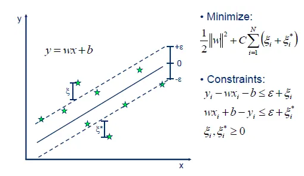

# Ajuste de Modelos Lineales

Vamos a tratar de resolver con técnicas de Machine Learning usando modelos lineales dos supuestos prácticos. Uno de ellos se resolverá usando Regresión y el otro usando Clasificación.

## Regresion
### 1.Problema

**Comprender el problema a resolver. Identificar los elementos X, Y, $f$ del problema y describirlos en detalle**

Usaremos la base de datos "Superconductividad" del siguiente enlace: https://archive.ics.uci.edu/ml/datasets/Superconductivty+Data

En dicho enlace vemos que no hay mucha información del problema, pero te redirecciona al siguiente enlace, donde sí que se explica el problema que vamos a tratar: https://www.sciencedirect.com/science/article/abs/pii/S0927025618304877?via%3Dihub 

Aquí podemos ver que se pretende estimar por medio de regresión la temperatura crítica superconductora en función de las características extraidas de la fórmula química del superconductor. Por lo tanto, esto no permite diferenciar los elementos del problema: 

- Por un lado $\mathcal{X}$ será la matriz de características, dónde en cada columna medimos una de las características de la fórmula química del superconductor. En total tenemos 81 características. Se nos proporciona una matriz de 21263x81.
  
- Por otra parte $\mathcal{Y}$ (nuestro vector de etiquetas) contiene las temperaturas para cada uno de los superconductores en los que hemos medido las 81 características. En nuestro caso, el vector $\mathcal{Y}$  viene pegado a la matriz $\mathcal{X}$, por lo que para manipularlo tendremos que separarlo.

- Finalmente la función que pretendemos estimar, y que es desconocida sería $f:\mathcal{X}\to\mathcal{Y}$ que nos asocia para cada vector de características una etiqueta.

### 2.Obtención
Una vez nos descargamos los datos de la base de datos mencionada en el apartado anterior, los metemos en nuestro directorio de trabajo en una carpeta llamada "datos", de manera que en nuestro código definiremos las siguientes variables para acceder a dichos ficheros: 

~~~py
#En el Fichero Regresion.py
NOMBRE_FICHERO_REGRESION = './datos/train.csv'

~~~

Después leemos los datos y los separamos en los conjuntos de Entrenamiento y Test (función LeerDatos) dejando un 80% de los datos en Entrenamiento y el 20% restante en Test (esta proporción de división es la más empleada y la que mejor resultados suele dar). Desde este momento en adelante no miraremos en ningún momento los datos de Test y todas las transformaciones que hagamos será en el conjunto de Entrenamiento, así evitaremos cometer "Data Snooping".

En el caso de Regresión, al tener una gran dimensionalidad los datos ($\mathbb{R}^{81}$), vamos a optar por no visualizar el conjunto de entrenamiento.

### 3.Clase de funciones a usar 

A continuación, tal y como se ha visto en Teoría, una vez comprendido el problema vamos a establecer la clase $\mathcal{H}$ de funciones que usaremos en nuestro modelo para estimar $f$.

Para el caso de regresión, dado que siempre vamos a tratar de elegir la clase $\mathcal{H}$ más simple posible (de acuerdo al principio de la Navaja de Okham) vamos a establecer la clase de combinaciones lineales con las características, de manera que la hipótesis que obtengamos tenga la forma: 
$$g(x)=w^{T}x$$

Es decir, nuestra clase $\mathcal{H}$ será el conjunto de todos los hiperplanos de $\mathbb{R}^{81}$, de manera que nuestro problema se reducirá a encontrar el vector de pesos $w$ empleando SGD (Gradiente Descendente estocástico). 

Tampoco he optado por una reducción de la dimensionalidad, ya que 81 atributos no me han parecido excesivos y lo que voy a intentar hacer es ajustar usando regularización para que aquellos atributos que tengan más importancia sean los que determinen el hiperplano en su gran mayoría.

### 4. Identificar las hipótesis finales que usará.
Una vez tenemos la clase de funciones H, utilizaremos *Validación Crizada* (Cross-Validation) para estimar los mejores parámetros para calcular nuestro mejor hiperplano (esto se explicará con detenimiento en el apartado 7). De esta forma hemos obtenido que la mejor hipótesis usando Regresión Lineal con Gradiente Descendente Estocástico es : 

~~~
Tiempo empleado para validación cruzada: 172.79697179794312s

El mejor modelo es:  Pipeline(steps=[('scaler', StandardScaler()),
                ('sgdregressor',
                 SGDRegressor(alpha=0.001, learning_rate='adaptive',
                              max_iter=5000, penalty='l1'))])
E_val calculado en cross-validation:  310.3011551086442
Error cuadratico medio en entrenamiento:  308.11983865894933
Error cuadratico medio en test:  318.4457322822056
~~~

Como podemos observar, el modelo que he considerado son un Pipeline de sklearn o cauce que permite hacer distintas transformaciones sobre los datos con un estimador final, en mi caso como para la obtención de pesos usamos el Gradiente Descendente Estocástico que es sensible al ecalado de las distintas características nuestra matriz x, por eso el modelo se se compone de una Estandarización de los datos y una posterior regresión lineal haciendo uso del Gradiente Descendente Estocástico. Tanto la estandarización como la función SGDRegressor serán explicadas en etapas posteriores.

Como podemos observar por los resultados obtenidos en Validación Cruzada y en el conjunto de Test, la distancia al cuadrado promedio de los puntos al hiperplano de regresión es muy elevado, lo que nos hace pensar que nuestro modelo no es capaz de explicar correctamente el conjunto de entrenamiento y por tanto tampoco el de test. En mi opinión estamos ante un caso de Underfitting, y por lo tanto no sería mala idea considerar otros modelos para resolver el problema. Más adelante propongo algunas alternativas. 

### 5. Partición en Training y Test

En el fichero venían los datos de entrenamiento y test unidos, es por ello que no hemos tenido que juntar datos para luego separarlos. 

Para dividir el dataset en Entrenamiento y Test usamos la función de sklearn.model_selection llamada  train_test_split de la siguiente forma:

~~~py
x_entrenamiento, x_test, y_entrenamiento, y_test = train_test_split(x,
 y, test_size = 0.2, random_state = 1)
~~~

Como podemos observar nos devuelve el conjunto de entrenamiento y test con sus respectivas etiquetas y los parámetros a utilizar son, el conjunto x de características, el vector y de datos, la fracción de datos que usaremos como test (usamos un 20% pues es lo más habitual) y usamos una semilla para que al repetir el experimeto en una máquina diferente se produzcan los mismos resultados.

### 6. Preprocesado de datos

En el caso de Regresión, dado que vamos a usar el gradiente descendente estocástico para la obtención del vector de pesos $w$, sabemos que este método es sensible al escalado de características (las características con valores más altos tienen más peso para el algoritmo)  y como podemos observar en la matriz de características $X$ del conjunto de entrenamiento, las distintas columnas toman valores en unos rangos muy diferentes: 

~~~

Matriz de características sin estandarizar: 

[[ 3.         50.1843462  54.6518077  ...  3.6375      0.81649658
   0.5290026 ]
 [ 5.         72.201783   55.58687193 ...  1.08571429  0.8
   0.47573788]
 [ 5.         64.60288064 76.13145764 ...  1.2075      1.32664992
   1.15518126]
 ...
 [ 4.         93.5306     54.27221333 ...  0.86666667  0.4330127
   0.24944383]
 [ 2.         96.98       97.082      ...  0.6         0.
   0.        ]
 [ 5.         92.34848    84.1192     ...  0.57142857  0.4
   0.34992711]]

Media:  540.9376180577132

Varianza:  3086277.8328085695

~~~
Además la media y la varianza son elevadas, lo que nos hace pensar que SGD no llegará a una solución adecuada si no estandarizamos previamente los datos.

Es por esto que en esta etapa de preprocesado vamos a hacer una estandarización utilizando la función StandardScaler() de sklearn.preprocessing y logrando así que nuestros datos se distribuyan según una Gausiana de media 0 y varianza 1.

~~~py
x=StandardScaler().fit_transform(x)
~~~

Aplicamos la función StandardScaler() a los datos de entrenamiento almacenando el resultado en x_estandarizado. Si ahora visualizamos x_estandarizado vemos lo siguiente: 

~~~

Matriz de características estandarizada: 

[[-0.76951558 -1.25516534 -0.54793834 ...  2.19994925 -0.04651646
  -0.31690616]
 [ 0.61634572 -0.51899723 -0.52028797 ... -0.40590505 -0.08049078
  -0.43365582]
 [ 0.61634572 -0.77307175  0.08722685 ... -0.28153887  1.00413228
   1.05559993]
 ...
 [-0.07658493  0.1941464  -0.55916316 ... -0.62959396 -0.83629245
  -0.92966436]
 [-1.46244623  0.30947946  0.70674605 ... -0.9019109  -1.72807188
  -1.47641434]
 [ 0.61634572  0.15462141  0.32342884 ... -0.93108772 -0.90428133
  -0.70941746]]

Media:  -4.1420349286751966e-16

Varianza:  0.9999999999999939
~~~

Ahora todas las características tienen un rango de valores similar y como podemos ver la media es 0 prácticamente y la varianza 1.

### 7. Métrica de error usada.

En el caso de regresión, en el modelo que hemos elegido usaremos como métrica de error el error cuadrático medio. Que nos da la media de los cuadrados de las distancias de los distintos puntos al hiperplano de regresión elegido. Su expresión es la siguiente: 

----------------------

----------------------

He optado por esta métrica de error por dos motivos: 

- En primer lugar porque suele ser la más usada en regresión, aunque podrían usarse otras como el coeficiente de determinación $R^2$, la media del valor absoluto de los errores, etc...

- En segundo lugar, porque debido a la alta dimensionalidad de los datos, se nos hace muy dificil entender qué está ocurriendo realmente en nuestro problema o cómo de bueno es nuestro estimador. Sin embargo, con el error cuadrático medio nos podemos hacer una idea de lo "lejos" que están los puntos del hiperplano de regresión y poder valorar lo bueno o malo que puede ser.

### 8. Ajuste del modelo (parámetros, regularización usada, etc...)
En primer lugar vamos a explicar qué modelo he elegido:

Como hemos comentado en etapas previas, el modelo va a consistir en una Estandarización de los datos + Regresión lineal aplicando Gradiente Descendente Estocástico para aproximar el vector de pesos. La estandarización ya se explicó en etapas previas, vamos a explicar ahora la Regresión Lineal. 

En primer lugar vamos a explicarla desde un punto de vista teórico y después daremos los detalles técnicos de cómo se aplicará al problema.

**Regresión Lineal**

Desde el punto de vista clásisco consiste en clacular el hiperplano de regresión que minimice el error cuadrático medio (en nuestro caso) de los distintos puntos de la muestra al hiperplano $h(x)=w^Tx$. 

Por lo tanto, el problema se reduce en encontrar el valor de los pesos $w=(w_1,w_2, ... , w_n)$ que minimicen este error. Para ello en teoría vimos diversas formas de obtenerlos, una de ellas era haciendo uso de la pseudoinversa, pero devido a la gran dimensionalidad de la matriz de datos de este problema vamos a descartar este método. El otro método que vimos fue usar SGD, y este es el que usaremos.

----------------------------------------------------------------

----------------------------------------------------------------

Como vemos en el pseudocódigo, este método se caracteriza por que en cada iteración del bucle principal, se mezclan los datos de la matriz X y el vector de los pesos no se actualiza teniendo en cuenta todas y cada una de las filas de la matriz X de características, sino que dividimos dicha matriz en Mini Batches (pequeños subgrupos) e iterando sobre dichos subgrupos vamos actualizando el vector de pesos w (tomando en consideración únicamente las filas de cada Mini Batch) en la dirección opuesta al gradiente , que intuitivamente podemos pensar que apunta a los mínimos de la función, ya sean locales o globales, multiplicada por una constante denominada "Learning Rate" o Tasa de aprendizaje que nos da el tamaño del paso que se da en cada actualización de los pesos. 

Las ventaja de este algoritmo con respecto al Gradiente Descendente básico es principalmente la ganancia de tiempo en ejecución, pues este algoritmo suele ser más rápido para conjuntos de datos muy grandes como es en nuestro caso.

Nosotros usaremos la función de sklearn.linear_model llamada SGDRegressor. Como podemos ver en las especificaciones de esta función, se implementa el algoritmo descrito en el pseudocódigo anterior con algunas modificaciones que podemos introducir cambiando los parámetros como cambiar la tasa de aprendizaje, la función de error, añadir términos de regularización etc... Vamos a comentar los parámetros que vamos a usar en nuestra *Rejilla de prarámetros*: 

- En primer lugar nos encontramos el parámetro 'loss', que es la función de error que vamos a minimizar, en nuestro caso usaremos el valor por defecto que es 'squared_loss' haciendo al error cuadrático medio.
- En segundo lugar tenemos el parámetro 'penalty', que hace referencia al término de regularización. En mi caso tenía claro que quería utilizar regularización de algún tipo, pero no sabía cuál se adaptaba mejor al problema, por eso he hecho una elección empírica de este parámetro y vamos a considerar dos posibles valores para este parámetro: 'l1' y 'l2', el primero haciendo referencia a regulariazción Lasso y el segundo haciendo referencia a regularización Ridge. 
  
  La diferencia entre estas dos es que en **Ridge**, a la función pérdida(error cuadrático medio) le añade un término de la forma $\lambda \sum_{i=1}^{n}w_i^2$ y consiguiendo reducir de esta forma el valor de todos los coeficientes *sin que ninguno de estos llegue a valer 0* y así reducimos la varianza de nuestra clase de funciones $\mathcal{H}$. 
  
  **Lasso** por su parte tiene el mismo propósito de reducir la varianza de $\mathcal{H}$ pero lo hace añadiendo a la función pérdida el término $\lambda \sum_{i=1}^{n}|w_i|$ lo cual fuerza que los coeficientes de los predictores tiendan a 0 y consiguiendo *eliminar así los coeficientes menos relevantes* por lo que este método tambien se usa en ocasiones para selección de características. 
  
  En ambos casos el término $\lambda$ a medida que aumenta aumenta la penalización de estos términos y disminuyen los coeficientes de forma más rápida.

- El parámetro 'alpha' es la constante que multiplica el término de regularización (el $\lambda$ que anteriormente mencionaba). En nuestro caso vamos a probar varios valores posibles para ver con cuál se comporta mejor el modelo.
  
  Los valores a tener en cuenta serán 0.0001 y 0.001. Los vamos a tomar pequeños para no penalizar en exceso los coeficientes que obtengamos.

- El parámetro 'learning_rate' hace referencia a la tasa de aprendizaje (el $\eta$ del pseudocódigo) y qué técnica vamos a usar para actualizarlo. Los posibles valores que vamos a tener en cuenta son: 
  'optimal' de manera que la tasa de aprendizaje se actualiza de acuerdo a la fórmula $\eta=\frac {1}{(\alpha *(t+t_0))}$ de acuerdo a la heurística de Leon Bottou

  'adaptive' con esta técnica, en un principio $\eta=\eta_0$ mientras que el error disminuya. Después, si en un determinado número de iteraciones no mejora el error, se divide por 5 la tasa de aprendizaje, así evitamos que el algoritmo se quede oscilando alrededor del mínimo por culpa de un learning rate muy elevado

  Hay más posibles valores, como tomar constante la tasa de aprendizaje pero nosotros solo vamos a probar estos dos.

- Después, establecemos que el parámetro $\eta_0$ para el caso 'adaptive' del punto anterior sea 0.01, para que avance rápido mientras pueda y establecemos que el máximo de iteraciones sean 5000. 

- Finalmente comentar que hay otros parámetros a estudiar que nosotros no hemos considerado por no complicar demasiado el proceso de elección de parámetros. Solo comentar que tenemos el parámetro 'shuffle' establecido a True por defecto que nos mezcla los datos en cada iteración, lo cual es parte del pseudocódigo que mencionábamos del SGD.

### 9. Selección de la mejor hipótesis del problema. 

Una vez establecida la Rejilla de Parámetros que vamos a estudiar solo queda ver con qué combinación de parámetros el algoritmo ofrece mejores resultados, por lo tanto necesitamos usar algún criterio para elegir esto sin hacer uso de los datos de Test, por eso usaremos Validación Cruzada para la elección del mejor estimador. 

Vamos a explicar brevemente en que consiste validación cruzada: 

Lo que vamos a hacer para estimar cúal es la potencial mejor hipótesis es que vamos a tomar el conjunto de Entrenamiento y lo vamos a dividir en nuestro caso en 5 partes iguales, de manera que en cada paso vamos a entrenar el modelo con 4 de las 5 partes y usaremos la restante para evaluarlo, finalmente hacemos la media de los errores obtenidos y de esta manera tendremos una idea más o menos acertada del comportamiento de nuestro modelo. 

Podemos ver el proceso en la siguiente imagen (es de un problema de clasificación, pero nos sirve): 

-------------------------------

-------------------------------

Por lo tanto, lo que vamos a hacer es generar todos los posibles modelos combiando los parámetros del apartado anterior y vamos a hacer validación cruzada con cada uno de estos modelos quedándonos con el que mejor resultados nos de. Para ello haremos uso de una función que he implementado llamada 

~~~py
def Evaluacion( modelos, x, y, 
x_test, y_test, 
k_folds, nombre_modelo) 
~~~
los parámetros que pasamos son el vector de modelos con todas las posibles combianciones (modelos), la matriz x de entrenamiento y el vector y de etiquetas de entrenamiento, lo mismo con los datos de test (x,y,x_test,y_test) y finalmente el número de particiones del conjunto de datos de entrenamiento para hacer validación cruzada (k_folds) y el nombre del modelo.

El método lo que hace es usar la función de sklearn.model_selection llamada cross_val_score que nos da una puntuación (score) para cada modelo haciendo validación cruzada y de acuerdo a una serie de parámetros, los parámetros que he usado son los siguientes:

~~~py
score = -np.mean(cross_val_score(model, x, y, 
cv = k_folds, scoring="neg_mean_squared_error",n_jobs=-1))
~~~

model hace referencia al modelo que estamos considerando para hacer validación cruzada, x, y son el conjunto de características de entrenamiento x y el vector de etiquetas de entrenamiento y, cv es la cantidad de particiones (en este caso habrá tantas como k_folds indique) y scoring es la métrica de error a usar, en este caso uso neg_mean_squared_error que es el error cuadrático medio cambiado de signo y n_jobs es si queremos paralelizar el proceso. Como cross_val_score nos devuelve un array con los resultados de validación cruzada en cada partición de test debemos hacer la media con np.mean() y cambiarle el signo pues está midiendo el error cuadrático medio con signo negativo.

Luego lo que hacemos ahora es el siguiente bucle: 

~~~py
best_score = 10000
    for model in modelos:
        print(model)
        score = -np.mean(cross_val_score(model, x, y, cv = k_folds, scoring="neg_mean_squared_error",n_jobs=-1))
        print('Error cuadrático medio del modelo con cv: ',score)
        #plot_confusion_matrix(model, x_train_reduced, y_train_unidime)
        if best_score > score:
            best_score = score
            best_model = model

~~~

De manera que iteramos sobre todos los modelos haciendo lo que hemos explicado antes y nos quedamos con el que mejor resultados de. 

Finalmente, el método Evaluacion concluye probando el modelo elegido en el conjunto de Test y los resultados son los especificados en el punto 4 de esta memoria.

Para el cálculo del $E_{out}$ como sabemos por lo estudiado en teoría que el $E_test$ es un estimador insesgado del $E_{out}$ vamos a estimar el error fuera de la muesta con el valor obtenido en $E_test$. En nuestro caso es: 

~~~py
Error cuadratico medio en test:  318.4457322822056
~~~

Luego $E_{test} \approx 318.44573$. 

Tiempo empleado para validación cruzada: 21.87s

### 10. Refinar modelo anterior

En este punto vamos a tratar de seleccionar la mejor hipótesis de nuestra clase de funciones de una manera distinta a la de apartados anteriores. Vamos a usar lo siguiente: 

---------------------------------------------------

---------------------------------------------------

Este hecho nos dice que si usamos Validación cruzada y hacemos grande el número k de subconjuntos, el error de validación que obtengamos será muy similar al error fuera de la muestra ($E_{out}$). 

El caso ideal sería que k fuera el número de filas de x (que son 21263) de esta manera cada modelo lo entrenaríamos con todos los datos salvo uno que usaríamos para probar el modelo y al hacer esto con todos los elementos de x y hacer la media de los errores obtendríamos una aproximación muy buena del error fuera de la muestra. 

Por lo tanto vamos a tratar de hacer esto. En nuestro caso hacer validación cruzada con la rejilla del apartado 8 tiene un coste computacional demasiado elevado y como considero que el objetivo de este apartado es probar est nuevo método para elegir modelo lo que vamos a hacer es considerar la misma rejilla pero con menos parámetros libres. En concreto fijaremos la tasa de aprendizaje a 'adaptive' y dejaremos libres únicamente el alpha de regularización que podría valer 0.0001 y 0.001 y la penalty que puede ser 'l1' ó 'l2'. De la misma forma hacer k=21263 es inviable , por eso vamos a coniderar que el conjunto de prueba tenga 50 elementos en cada etapa de validación cruzada y así nos sale que k=450 y se obtiene también una buena aproximación. Los resultados obtenidos son los siguientes:

~~~
Tiempo empleado para validación cruzada: 313.68566966056824s

El mejor modelo es:  Pipeline(steps=[('scaler', StandardScaler()),
                ('sgdregressor',
                 SGDRegressor(alpha=0.001, learning_rate='adaptive',
                              max_iter=5000, penalty='l1'))])
E_val calculado en cross-validation:  316.58210748269147
Error cuadratico medio en entrenamiento:  309.69880133580216
Error cuadratico medio en test:  316.20990825010426
~~~

El método para obtener estos datos ha sido usar la función Evaluacion() explicada anteriormente y dado que no estaba pensada para hacer este tipo de validación cruzada lo que he hecho ha sido pasar como parámetros x e y que serían los datos completos junto con x_test e y_test. Así solo habría que tener en cuenta que hay que ignorar las dos últimas líneas del error en test y train.

Como podemos observar con esta forma de elegir la mejor hipótesis no sale el mismo resultado del apartado 4 habíamos dicho, solo que hemos entrenado con más datos y por tanto hemos refinado el modelo obteniendo mejores resultados en $E_out$ que ahora pasaría a ser :

$E_{out} \approx E_{val}= 316.58210748269147$

frente a los  318.4457322822056 que habíamos obtenido en el apartado anterior.

### Otros modelos

Finalmente he probado otros modelos para regresión con los que comparar el que hemos analizado en profundidad. 

La métrica de error empleada en los siguientes modelos ha sido la misma siempre: error cuadrático medio. Por otro lado, la clase de hipótesis $\mathcal{H}$ ha sido la misma (el conjunto de todos los hiperplanos) y la partición de entrenamiento y test ha sido la misma que en el modelo anterior, de hecho he empleado los mismos conjuntos de entrenamiento y test para estos nuevos modelos. Finalmente el preprocesado de datos consiste en una estandarización en el caso del SVM aplicado a Regresión y una estandarización + reducción de dimensionalidad en el caso del otro modelo que explicaremos después.

#### SVM aplicado a Regresión Lineal
En clase vimos como SVM era un modelo de clasificación que permitía separar los datos mediante un pasillo de cierta amplitud $\epsilon$ de manera que nos permitía cierto margen de generalización a la hora de estimar nuevos datos con nuestro clasificador. No obstante este método se explicará con detenimiento en la próxima sección. 

Pues existe una generalización de este modelo aplicado a problema de regresión. La primera diferencia que vemos con Regresión Lineal clásica es que vamos a encontrar un "pasillo" de regresión, de manera en nuestra función de error a minimizar vamos a "tolerar" un cierto error (dependiendo de la anchura que establezcamos del pasillo). Veamoslo con un ejemplo en $\mathbb{R}^2$:

---------------------------------------

---------------------------------------

En este caso como podemos ver, vamos a tolerar una cantidad $\epsilon$ de error en los datos, de manera que la función a minimizar en este caso concreto solo tendría en cuenta la proyección de los puntos fuera del pasillo al pasillo, y los puntos de dentro directamente no se tienen en cuenta en la función a minimizar.

El método de sklearn que realiza esto se denomina LinearSVR y está en sklearn.svm. 

Dicha fucnión tiene diversos parámetros a ajustar, por lo que la rejilla de parámetros que usaremos será la siguiente: 

- El parámetro 'Kernel' viene por defecto a 'linear' en este modelo, y ya que en esta práctica trabajamos con modelos lineales, en nuestro caso es $<x,x'>$. Este truco del kernel nos permite transformar las características a otro espacio de dimensión mayor en el que se puede encontrar una solución mejor lineal para el problema sin calcular explicitamente las coordenadas de los datos en el nuevo espacio. 

- random_state=0 lo finamos una semilla para que el proceso sea reproducible en otra máquina.
- Fijamos el máximo de iteraciones a 10000 pues es más rápido que SGD.
- Finalmente, el parámetro que variamos será el 'epsilon' que hace referencia a la amplitud del pasillo, que probaremos los valores desde 1 a 3.5 incrementando de 0.5 en 0.5

Con esto usamos la función de Evaluación ya explicada y obtenemos los siguientes resultados: 

~~~

 ------------------------------------------------------------
 Evaluando SVM aplicado a Regresión
------------------------------------------------------------

------ Comienza Validación Cruzada------

Pipeline(steps=[('scaler', StandardScaler()),
                ('SVR', LinearSVR(epsilon=1, max_iter=10000, random_state=0))])
Error cuadrático medio del modelo con cv:  325.915529564534
Pipeline(steps=[('scaler', StandardScaler()),
                ('SVR',
                 LinearSVR(epsilon=1.5, max_iter=10000, random_state=0))])
Error cuadrático medio del modelo con cv:  325.5816116323339
Pipeline(steps=[('scaler', StandardScaler()),
                ('SVR', LinearSVR(epsilon=2, max_iter=10000, random_state=0))])
Error cuadrático medio del modelo con cv:  325.0377019496618
Pipeline(steps=[('scaler', StandardScaler()),
                ('SVR',
                 LinearSVR(epsilon=2.5, max_iter=10000, random_state=0))])
Error cuadrático medio del modelo con cv:  324.4560825564662
Pipeline(steps=[('scaler', StandardScaler()),
                ('SVR', LinearSVR(epsilon=3, max_iter=10000, random_state=0))])
Error cuadrático medio del modelo con cv:  323.7216735757851
Pipeline(steps=[('scaler', StandardScaler()),
                ('SVR',
                 LinearSVR(epsilon=3.5, max_iter=10000, random_state=0))])
Error cuadrático medio del modelo con cv:  322.889058980888

Tiempo empleado para validación cruzada: 23.691235065460205s

El mejor modelo es:  Pipeline(steps=[('scaler', StandardScaler()),
                ('SVR',
                 LinearSVR(epsilon=3.5, max_iter=10000, random_state=0))])
E_val calculado en cross-validation:  322.889058980888
Error cuadratico medio en entrenamiento:  320.57729054032677
Error cuadratico medio en test:  329.1490070748543
~~~

Y como podemos observar el mejor modelo sería el que más ancho tiene el pasillo. No obstante los resultados obtenidos serían peores que con el modelo elegido en los apartados anteriores, ya que tanto el error de validación cruzada como el $E_(test)$ son peores en este caso. De todas formas si ahora ejecutamos el método de Evaluacion() con la mejor hipótesis de SVR y la mejor hipótesis de Regresión Lineal obtenemos lo siguiente:

~~~
 ------------------------------------------------------------
 Evaluando Elección entre SVM o Regresion Lineal
------------------------------------------------------------

------ Comienza Validación Cruzada------

Pipeline(steps=[('scaler', StandardScaler()),
                ('sgdregressor',
                 SGDRegressor(alpha=0.001, learning_rate='adaptive',
                              max_iter=5000, penalty='l1'))])
Error cuadrático medio del modelo con cv:  310.4721896797197
Pipeline(steps=[('scaler', StandardScaler()),
                ('SVR',
                 LinearSVR(epsilon=3.5, max_iter=10000, random_state=0))])
Error cuadrático medio del modelo con cv:  322.889058980888

Tiempo empleado para validación cruzada: 5.395215272903442s

El mejor modelo es:  Pipeline(steps=[('scaler', StandardScaler()),
                ('sgdregressor',
                 SGDRegressor(alpha=0.001, learning_rate='adaptive',
                              max_iter=5000, penalty='l1'))])
E_val calculado en cross-validation:  310.4721896797197
Error cuadratico medio en entrenamiento:  308.11983865894933
Error cuadratico medio en test:  318.4457322822056
~~~

Que concuerda con lo que hemos dicho.

#### Regresión Lineal con SGD y reducción de dimensionalidad.
Ahora vamos a probar con otro modelo pero que en vez de cambiar la técnica con la que obtenemos el vector de pesos $w$ vamos a cambiar el preprocesado de datos tratando de reducir la dimensionalidad. Para ello vamos a hacer uso de la matriz de correlaciones. 

En primer lugar estandarizamos los datos de entrenamiento, y después transformamos el vector de características x_entrenamiento a un dataframe de Pandas que tiene el método corr() para clacular la matriz de correlaciones de manera sencilla.

Antes de continuar vamos a dar una breve explicación de qué es la matriz de correlaciones y como nos puede ayudar en nuestro problema. 

La matriz de correlaciones es una matriz simétrica que nos ayuda a ver la dependencia lineal entre las distintas variables de la matriz x con ayuda del coeficiente de correlación de Pearson, dicho coeficiente en la casilla (i,j) da un valor entre -1 y 1 que cuanto más cercano a +-1 significa que la variable i depende linealmente de j y cuanto más próximo a 0 expresa lo contrario. Veamos un ejemplo sencillo: 

-------------------------

-------------------------

Como vemos la diagonal siempre tendrá 1 pues a depende linealmente de a, b de b, etc... Y por otro lado podemos ver como a y b no presentan una gran dependencia lineal, a y c presentan una moderada dependencia lineal y b y c una alta dependencia lineal.

Lo que vamos a tratar de hacer es eliminar en este caso la variable c, ya que como depende linealmente de b no nos aporta gran información para el ajuste del modelo.

Dicho esto, al calcular la matriz de correlacion obtenemos lo siguiente: 

~~~
          0         1         2   ...        78        79        80
0   1.000000 -0.142286 -0.352568  ... -0.444806  0.104686  0.032874
1  -0.142286  1.000000  0.818344  ...  0.169515 -0.080894 -0.081937
2  -0.352568  0.818344  1.000000  ...  0.329972 -0.004651  0.076186
3  -0.292156  0.940918  0.848909  ...  0.270171 -0.125929 -0.117964
4  -0.452994  0.749778  0.964489  ...  0.406849 -0.035051  0.028868
..       ...       ...       ...  ...       ...       ...       ...
76  0.892903 -0.147324 -0.331976  ... -0.636372  0.089444  0.079550
77  0.232266 -0.107907 -0.041360  ...  0.114691  0.973687  0.866231
78 -0.444806  0.169515  0.329972  ...  1.000000  0.184720  0.132330
79  0.104686 -0.080894 -0.004651  ...  0.184720  1.000000  0.885792
80  0.032874 -0.081937  0.076186  ...  0.132330  0.885792  1.000000

[81 rows x 81 columns]
~~~

La podemos representar en un mapa de calor: 

-------------------------

-------------------------

En este mapa de calor podemos ver que hay atributos con una gran dependencia lineal, vamos a tratar de filtrar un poco los datos que se muestran, mostrando aquellos con coeficiente de correlación mayor que 0.9 en valor absoluto. 

-------------------------

-------------------------

Las parejas con coeficiente de correlación mayor que 0.9 en valor abosluto serían:

~~~
15  25    0.997735
72  74    0.994974
15  75    0.992728
12  14    0.992276
71  73    0.990012
  
15  35    0.903247
35  75    0.901795
0   55    0.901438
42  44    0.900145
12  24   -0.913154
Length: 75, dtype: float64
~~~

Luego eliminando uno de los miembros de cada pareja eliminamos el siguiente vector de características: 

$v=[0,2,5,6,7,11,12,15,17,20,22,26,25,27,33,37,47,52,57,67,69,70,71,72,77]$

Y con la nueva matriz de entrenamiento de dimensión 58 aplicamos SGDRegressor con la misma rejilla de parámetros del primer apartado, obteniendo los siguientes resultados: 

~~~
Tiempo empleado para validación cruzada: 262.13657307624817s

El mejor modelo es:  Pipeline(steps=[('scaler', StandardScaler()),
                ('sgdregressor',
                 SGDRegressor(alpha=0.001, learning_rate='adaptive',
                              max_iter=5000, penalty='l1'))])
E_val calculado en cross-validation:  341.7399457998229
Error cuadratico medio en entrenamiento:  339.6735889458566
Error cuadratico medio en test:  340.77195194507397
~~~

Como podemos ver, no ha sido una buena práctica la eliminación de atributos, ya que aunque el mejor modelo resulta ser el mismo que hemos explicado al principio del guión, además de no mejorar el error obtenido tanto en validación como en test dicho error se empeora. Esto puede deberse a que la eliminación de dichos atributos han hecho perder información al modelo para ajustar mejor los datos y por lo tanto los explica peor. 

Como conclusión, la reducción de la dimensión no es una práctica que siempre de buenos resultados y hay que tener mucho cuidado para no eliminar atributos que aporten información al modelo. En mi caso quizá tendría que haber puesto una cota mayor al coeficiente de correlación de pearson del tipo 0.95 en valor absoluto para eliminar características que verdaderamente no aporten información relevante.

## Clasificación

### 1.Problema

**Comprender el problema a resolver. Identificar los elementos X, Y, $f$ del problema y describirlos en detalle**

Usaremos la base de datos "Sensorless Drive Diagnosis" del siguiente enlace: https://archive.ics.uci.edu/ml/datasets/Dataset+for+Sensorless+Drive+Diagnosis

El problema a tratar consiste en el Diagnóstico de unidad sin sensor, si leemos la descripción del problema nos dicen que las características se extraen de la corriente del motor, el motor además tiene componentes intactos y defectuosos y esto se traduce en 11 clases diferentes, con diferentes condiciones. Por lo que nos encontramos ante un problema de *Clasificación multiclase*.

Vamos a tratar de identificar los elementos: 

- Por un lado $\mathcal{X}$ nuevamente es la matriz de características observadas en los distintos elementos. En este caso tenemos un total de 58509 instancias en las que se han medido 48 atributos reales, por lo que disponemos de una matriz $\mathcal{X}$ de 58509x49
- Como se ha mencionado, disponemos de 11 posibles clases dónde agrupar los elementos, y si miramos el fichero txt dónde vienen las características de cada elemento, podemos ver que al final de cada tupla viene un número del 1 al 11 haciendo referencia a la clase a la que pertenece cada elemento. Luego nuestro vector $\mathcal{Y}$ de etiquetas será un vector columna de 58509x1 dónde cada posición en el vector toma un valor entre 1 y 11.
- Finalmente la función que deseamos aproximar es $f:\mathcal{X}\to\mathcal{Y}$ que es desconocida y nos asocia cada elemento a una clase de entre las 11.

### 2.Obtención y visualización de los datos
Una vez nos descargamos los datos de la base de datos mencionada en el apartado anterior, los metemos en nuestro directorio de trabajo en una carpeta llamada "datos", de manera que en nuestro código definiremos las siguientes variables para acceder a dichos ficheros: 

~~~py

#En el Fichero Clasificacion.py
NOMBRE_FICHERO_CLASIFICACION = './datos/Sensorless_drive_diagnosis.txt'
~~~

Después leemos los datos y los separamos en los conjuntos de Entrenamiento y Test (función LeerDatos) dejando un 80% de los datos en Entrenamiento y el 20% restante en Test (esta proporción de división es la más empleada y la que mejor resultados suele dar). Desde este momento en adelante no miraremos en ningún momento los datos de Test y todas las transformaciones que hagamos será en el conjunto de Entrenamiento, así evitaremos cometer "Data Snooping".

En el caso de Clasificación si que vamos a optar por visualizar los datos de entrenamiento. Para ello dado que los datos están en una dimensión que no podemos visualizar ($\mathbb{R}^{49}$) vamos a aplicar el algoritmo TSNE, una algoritmo muy empleado para reducir la dimensionalidad y tratar de visualizar datos en 2-3 dimensiones conservando parcialmente su estructura. El funcionamiento de dicho algoritmo, en rasgos generales es el siguiente:

- Calcular una distribución de probabilidad conjunta que represente las similitudes entre los puntos de datos.

- Crear un conjunto de datos de puntos en la dimensión objetivo y luego calcular la distribución de probabilidad conjunta para ellos también.

- Usar el descenso de gradiente para cambiar el conjunto de datos en el espacio de baja dimensión de modo que la distribución de probabilidad conjunta que lo representa sea lo más similar posible a la de la dimensión alta.

La pega que tiene el algoritmo es que es algo lento en tiempo de ejecución, por eso, únicamente pondré los resultados obtenidos (para repetir el experimento descomentar las líneas comentadas en el archivos Clasificacion.py). La sentencia en cuestión es: 

~~~py
X_visualizar=TSNE(n_components=2).fit_transform(x)
~~~

Usamos el objeto TSNE de la biblioteca sklearn.manifold, y especificamos en la variable n_components las dimensiones a las que reducimos los datos, y luego con fit_transform decimos que se apliquen estas transformaciones a los datos de entrenamiento y se almacene el resultado en X_visualizar. El resultado obtenido es el siguiente:

---------------------------------------------------------------------

---------------------------------------------------------------------

Como podemos observar, las distintas clases se encuentran muy solapadas, lo que nos hace pensar que quizá en el preprocesamiento de datos tendremos que hacer algo para tratar de diferenciarlas un poco y que nuestro modelo funcione mejor.

### 3.Clase de funciones a usar 

A continuación, tal y como se ha visto en Teoría, una vez comprendido el problema vamos a establecer la clase $\mathcal{H}$ de funciones que usaremos en nuestro modelo para estimar $f$.

Para el caso de clasificación, al igual que en regresión, vamos a establecer la clase de combinaciones lineales con las características, de manera que la hipótesis que obtengamos tenga la forma: 
$$g(x)=w^{T}x$$

Es decir, nuestra clase $\mathcal{H}$ será el conjunto de todos los hiperplanos de $\mathbb{R}^{48}$, de manera que nuestro problema se reducirá a encontrar el vector de pesos $w$ empleando SGD (Gradiente Descendente estocástico). 

Tampoco he optado por una reducción de la dimensionalidad, ya que 48 atributos no me han parecido excesivos y lo que voy a intentar hacer es ajustar usando regularización para que aquellos atributos que tengan más importancia sean los que determinen el hiperplano en su gran mayoría.

### 4. Identificar las hipótesis finales que usará.

Una vez tenemos la clase de funciones H, utilizaremos *Validación Cruzada* (Cross-Validation) para estimar los mejores parámetros para calcular nuestro mejor hiperplano (esto se explicará con detenimiento en el apartado 7). De esta forma hemos obtenido que la mejor hipótesis usando Regresión Lineal con Gradiente Descendente Estocástico es : 

~~~
------------------------------------------------------------
 Evaluando Regresion Logística
------------------------------------------------------------

------ Comienza Validación Cruzada------

Tiempo empleado para validación cruzada: 216.6149561405182s

El mejor modelo es:  Pipeline(steps=[('scaler', StandardScaler()),
                ('Regresion Logística',
                 SGDClassifier(alpha=0.001, eta0=0.01, learning_rate='adaptive',
                               loss='log', max_iter=10000, penalty='l1',
                               random_state=1))])
E_val calculado en cross-validation:  0.7503580594475331
Accuracy en entrenamiento:  0.7531565791441451
Accuracy en test:  0.7475645188856606
~~~

Igual que en regresión hemos usado un Pipeline de sklearn para definir el modelo, que se compone de Etandarización+Regresión Logística usando SGD. La función que hemos usado para esto la explicaremos en los apartados siguientes. 

Como podemos observar (usando el accuracy que explicaremos luego como métrica de error), la precisión en test es de un  0.7475645188856606, muy similar al error de validación y el error en entrenamiento, algo muy aceptable en mi opinión teniendo en cuenta la gran cantidad de datos y lo solapados que estaban cuando los hemos visualizado con TSNE. No obstante vamos a considerar más adelante otros modelos para tratar de mejorar esta precisión.

### 5. Partición en Training y Test

En el fichero venían los datos de entrenamiento y test unidos, es por ello que no hemos tenido que juntar datos para luego separarlos. 

Este caso es prácticamente idéntico al de Regresión, pero con una salvedad importante. Al tener 11 clases diferentes, debemos ver si están balanceadas y que la estratificación de los datos se produzca de acuerdo al número de elementos que haya de cada clase, pues está  el riesgo de que al dividir los datos, nuestro conjunto de entrenamiento y test no fueran representativos. 

Es por eso que usamos la misma función pero especificando que se estratifique según las etiquetas de y (stratify=y): 

~~~py
x_entrenamiento, x_test, y_entrenamiento, y_test = train_test_split(x, 
y, test_size = 0.2, random_state = 1, stratify=y)
~~~

A cotinuación mostramos la cantidad de elementos por clase en el conjunto de datos antes de separarlo en entrenamiento y test y tras la división: 

---------------------------------------------------------------------

---------------------------------------------------------------------

---------------------------------------------------------------------

---------------------------------------------------------------------

Como vemos, en el datset original las clases estaban perfectamente balanceadas y tras la división se sigue manteniendo ese balanceo.

### 6. Preprocesado de datos

Igual que en el caso de Regresión, dado que vamos a usar el gradiente descendente estocástico para la obtención del vector de pesos $w$, sabemos que este método es sensible al escalado de características (las características con valores más altos tienen más peso para el algoritmo)  por ello vamos a estandariazr los datos. Primero veamos la matriz x de entrenamiento sin estandarizar: 

~~~
Matriz de características sin estandarizar: 

[[ 2.7425e-06  1.4014e-06 -2.5539e-05 ... -1.4992e+00 -1.4992e+00
  -1.4992e+00]
 [ 5.4957e-06  5.2605e-05  2.0438e-04 ... -1.4942e+00 -1.4942e+00
  -1.4937e+00]
 [-3.7350e-06  1.0879e-06 -1.2482e-04 ... -1.4969e+00 -1.4969e+00
  -1.4970e+00]
 ...
 [-6.6196e-06  3.9460e-05  1.2952e-04 ... -1.4960e+00 -1.4961e+00
  -1.4959e+00]
 [-7.2586e-06  8.4127e-06 -6.9297e-06 ... -1.4973e+00 -1.4973e+00
  -1.4972e+00]
 [ 4.6493e-06 -1.7738e-06 -1.5487e-05 ... -1.4955e+00 -1.4954e+00
  -1.4954e+00]]

Media:  0.6497829056933107

Varianza:  33.18397562558432
~~~
En este caso la media está cercana a 0 pero la varianza es elevada, lo que nos hace pensar que SGD no llegará a una solución adecuada si no estandarizamos previamente los datos.

Igual que en Regresión, usaremos la función StandardScaler() de sklearn.preprocessing, logrando así que nuestros datos se distribuyan según una Gausiana de media 0 y varianza 1.

~~~py
x=StandardScaler().fit_transform(x)
~~~

Aplicamos la función StandardScaler() a los datos de entrenamiento almacenando el resultado en x_estandarizado. Si ahora visualizamos x_estandarizado vemos lo siguiente: 

~~~
Matriz de características estandarizada: 

[[ 0.08346936  0.00202028 -0.11577076 ... -0.45101455 -0.44430817
  -0.47631797]
 [ 0.11999584  0.96425524  0.8594354  ...  1.12121948  1.12884215
   1.24765266]
 [-0.00246713 -0.00387111 -0.53687316 ...  0.27221311  0.27934098
   0.21327028]
 ...
 [-0.04073689  0.71723006  0.54191517 ...  0.55521523  0.53104503
   0.55806441]
 [-0.04921445  0.13377895 -0.03683903 ...  0.14643438  0.15348895
   0.15058044]
 [ 0.10876672 -0.05764913 -0.073135   ...  0.71243863  0.75128607
   0.71478901]]

Media:  2.9780677251258063e-13

Varianza:  0.9999999999999973
~~~

Ahora todas las características tienen un rango de valores similar y como podemos ver la media es 0 prácticamente y la varianza 1.

### 7. Métrica de error usada.

En el caso de clasificación, en el modelo que hemos elegido usaremos como métrica de error el *Accuracy* o precisión, que se obtiene de la siguiente manera: 

$$Accuracy=\frac{TP+TN}{P+N}$$

Dónde TP y TN son los elementos clasificados correctamente como positivos y negativos y en el denominador P+N son la suma de todos los elementos. Como comentario, dado que nos encontramos ante un problema de Clasificación Multiclase, al usar regresión Logística lo que estamos haciendo es medir la probabilidad de que un cierto elemento pertenezca a cada una de las clases, en nuestro caso son 11, de manera que el algoritmo asigna la etiqueta de la clase con mayor probabilida de pretenencia. Por lo tanto los TP serán aquellos elementos cuya clase de pertenencia coincide con la clase que ha estimado el modelo.

La técnica que se usa para esto se denomina One vs All o One vs Rest y la explicaremos más adelante.

He elegido esta métrica porque nos da el porcentaje de acierto de nuestro modelo al tratar de clasificar datos, lo cual es una información fácil de interpretar y la considero muy oportuna para este problema. Además como los datos están balanceados tal y como hemos visto antes no corremos riesgo de que el Accuracy sea engañoso.

### 8. Ajuste del modelo (parámetros, regularización usada, etc...)

El modelo elegido ha sido el siguiente:

Como hemos comentado en etapas previas, el modelo va a consistir en una Estandarización de los datos + Regresión Logística con One vs All aplicando Gradiente Descendente Estocástico para aproximar el vector de pesos. La estandarización ya se explicó en etapas previas, vamos a explicar ahora la Regresión Logística. 

En primer lugar vamos a explicarla desde un punto de vista teórico y después daremos los detalles técnicos de cómo se aplicará al problema.

**Regresión Logística con One vs All**

Primero demos un breve repaso al método de Regresión Logística clásico. 

Este método consiste en encontrar un hiperplano que separe  las dos clases de elementos que estamos analizando, de manera que al evaluar nuevos puntos en nuestro modelo, con ayuda de una función no lineal nos diga la probabilidad de pertenencia a una clase u a otra. 

Esta función por lo general es la función sigmoide $\theta$ que tiene una asíntota horizontal en 1 y otra en 0. Su gráfica es la siguiente: 

-------------------------------------

-------------------------------------

Lo interesante de esta función es que nos permmite establecer una frontera de decisión con el hiperplano de manera que en el caso de 2 clases a separar (por comodidad supongamos que son 0 y 1), los elementos por debajo del hiperplano ($w^Tx<0$) tendrán una probabilidad por debajo del 0.5 de pertenecer a la clase 1 por ejemplo, y podríamos establecer que en en ese caso se asigne la etiqueta 0 a esos datos. De la misma forma podríamos decir que los datos por encima del hiperplano ($w^Tx\geq0$) con probabilidad mayor o igual que 0.5 podrían pertenecer a la clase 1 y por lo tanto asignamos dicha etiqueta. 

Los límites según los cuales determinar si un elemento pertenece a una clase u otra se pueden modificar, no necesariamente debe ser 0.5 y muchas veces depende del problema. Por ejemplo si estamos estudiando si decirle a una persona que tiene cancer (1) o que no lo tiene (0) deberíamos estar mucho más seguros que al 50%, por ejemplo se podría decir que tiene cancer si la probabilidad de pertenecer a 1 es del 0.9 o superior.

Nosotros, en nuestro problema usaremos una variante de este método, ya que no tenemos 2 clases posibles sino 11. En este caso lo que suele hacerse es el método *One vs all* en el cual para cada una de las 11 clases haremos lo siguiente: 

- Nos fijamos en la clase i, y tratamos todas las demás clases como una sola, y resolvemos el problema de separar i del resto como en el algoritmo de Regresión Logística clásico. 
- Hacemos esto para todas las clases obteniendo así 11 hiperplanos de clasificación 
- Cuando valoramos la pertenencia de un elemento nuevo $x$ a una clase lo que hacemos es valorar la probabilidad de que este elemento pertenezca a cada una de las 11 clases usando estos 11 hiperplanos. 
- Finalmente nos fijamos en qué hiperplano ha obtenido mayor probabilidad de pertnencia de entre los 11 que hemos comentado y esta será la clase que asociaremos al elemento $x$

La siguiente imagen podría ser de ayuda para entender esto. Se ha obtenido del curso Machine Learning de Andrew Ng.

-------------------------------------

-------------------------------------

Como vemos, una vez obtenemos $h_{\theta}^i(x)$ que es la probabilidad de que x pertenezca a la clase i para todas las clases psibles, sólo habría que tomar el máximo de estas $h_{\theta}^i(x)$ y decir que a la clase i es a la que pertenece $x$.

Por útlimo, antes de pasar a detalles técnicos de la implementación de este modelo, comentar que los coeficientes del hiperplano de clasificación se calculan con SGD de la misma forma que se explicó en Regresión, pero esta vez con una nueva función de error, la siguiente: 

-------------------------------------

-------------------------------------

Nosotros usaremos la función de sklearn.linear_model llamada SGDClassifier.Como podemos ver en las especificaciones de esta función, se implementa el algoritmo descrito anteriormente con algunas modificaciones que podemos introducir cambiando los parámetros como cambiar la tasa de aprendizaje, la función de error, añadir términos de regularización etc... Vamos a comentar los parámetros que vamos a usar en nuestra *Rejilla de prarámetros*: 

- En primer lugar nos encontramos el parámetro 'loss', que es la función de error que vamos a minimizar, en nuestro caso usaremos el valor 'log' que hace referencia a la función de error de la imagen anterior y que dijimos que usaríamos.
- En segundo lugar tenemos el parámetro 'penalty', que hace referencia al término de regularización. He hecho una elección empírica de este parámetro  viendo con cuál se comporta mejor, por eso vamos a considerar dos posibles valores para este parámetro: 'l1' y 'l2', el primero haciendo referencia a regulariazción Lasso y el segundo haciendo referencia a regularización Ridge que ya explicamos en Clasificación.

- El parámetro 'alpha' es la constante que multiplica el término de regularización (el $\lambda$ que anteriormente mencionaba). En nuestro caso vamos a probar varios valores posibles para ver con cuál se comporta mejor el modelo.
  
  Los valores a tener en cuenta serán 0.001 y 0.01. Los vamos a tomar pequeños para no penalizar en exceso los coeficientes que obtengamos.

- El parámetro 'learning_rate' hace referencia a la tasa de aprendizaje (el $\eta$ del pseudocódigo) y qué técnica vamos a usar para actualizarlo. Los posibles valores que vamos a tener en cuenta son los mismos que en Regresión: optimal y adaptive.
- El parámetro 'early_stopping' se usa para parar antes el algoritmo si durante una serie de iteraciones especificadas internamente, el error de validación cruzada no mejora. Por defecto está a False pero vamos a considerar en nuestra rejilla que pueda ser True también.
- El parámetro 'average' cuando se establece a True, calcula los pesos SGD promediados en todas las actualizaciones y almacena el resultado en el atributo coef_ que es dónde tenemos los coeficientes del modelo. Vamos a considerar en la Rejilla que pueda valer True o False.
  
- Después, establecemos que el parámetro $\eta_0$ para el caso 'adaptive' del punto anterior sea 0.01 y establecemos que el máximo de iteraciones sean 10000 y el parámetro 'random_state' lo establecemos a 1 para la semilla. 

Finalmente comentar que hay otros parámetros a estudiar que nosotros no hemos considerado por no complicar demasiado el proceso de elección de parámetros. 

### 9. Selección de la mejor hipótesis del problema. 

La selección del modelo se hace de la misma forma que se explicó en Regresión Lineal, fijándonos en el error de validación y usando el método Evaluacion(). Así se elige la hipótesis del apartado 4.

Para el cálculo del $E_{out}$ como sabemos por lo estudiado en teoría que el $E_test$ es un estimador insesgado del $E_{out}$ vamos a estimar el error fuera de la muesta con el valor obtenido en $E_test$. En nuestro caso es: 

~~~py
Accuracy en test:  0.7475645188856606
~~~

Luego $E_{test} \approx 0.7475645188856606$. Como vimos ya en Regresión, se puede afinar más esta aproximación y lo vamos a hacer en el apartado siguiente.

### 10. Refinar modelo anterior

De nuevo optaremos por un cálculo empírico del error $E_{out}$ con el dilema de la elección de k explicado en Regresión Lineal.

En este caso como tenemos muchos más datos que en Regresión Lineal (58509) por lo que es inviable elegir k=58509 y lo que vamos a hacer es particiones de 100 elementos en validación (pues son un conjunto muy pequeño comparado con el total), eligiendo k=585. Así nos aseguramos que el erro en Validación es muy similar al de fuera de la muestra. Usamos de nuevo la función Evaluacion().

~~~
  ------------------------------------------------------------
 Evaluando Regresion Logística usando SGD
------------------------------------------------------------

------ Comienza Validación Cruzada------

Pipeline(steps=[('scaler', StandardScaler()),
                ('Regresion Logística',
                 SGDClassifier(alpha=0.001, average=True, eta0=0.001,
                               loss='log', max_iter=10000, random_state=1))])

Precisión usando validación cruzada:  0.7297655919438097

Tiempo empleado para validación cruzada: 320.7461540699005s

El mejor modelo es:  Pipeline(steps=[('scaler', StandardScaler()),
                ('Regresion Logística',
                 SGDClassifier(alpha=0.001, average=True, eta0=0.001,
                               loss='log', max_iter=10000, random_state=1))])
E_val calculado en cross-validation:  0.7297655919438097
Accuracy en entrenamiento:  0.730040378575854
Accuracy en test:  0.7283370364040335
~~~

Como antes debemos ignorar los dos últimos y nos quedamos con el error de validación de  0.729765591943809. Como vemos, al haber entrenado con más datos el modelo hemos reducido un poco la precisión (hemos refinado el modelo), pero nos da una idea del error fuera de la muestra y de que no es un mal clasificador.

### Otros modelos

Finalmente comentar que para comparar el clasificador que hemos obtenido he probado con otros modelos: 

**Estandarización + SVM**

En este modelo vamos a usar en un primer lugar una estandarización de los datos igual que en Regresión Lineal. Pero vamos a usar SVM (Support Vector Machine).

Vamos a explicar un poco las SVM para entender mejor el modelo: 

Surgen del problema de separar dos conjuntos de datos como los de la siguiente imagen: 

--------------------------

--------------------------

Como podemos ver hay muchos hiperplanos para serparar correctamente estos dos conjuntos de datos, pero si tuvieramos que quedarnos con uno, ¿Cuál sería el mejor?

Intuitivamente sería aquel que pasara exactamente por medio de los dos conjuntos, y usando el concepto de margen ese será justo el que elijamos. Dicho de otra forma, vamo a tratar de encontrar el pasillo de amplitud máxima que separa los datos. En nuestro ejemplo sería el siguiente: 

--------------------------

--------------------------

Como vemos, el margen es la amplitud máxima del pasillo que podemos elegir y viene definido por los puntos que dan el nombre al método, los puntos de soporte o vectores de soporte. 

Los vectores de soporte son aquellos que se quedan en la frontera del pasillo de amplitud máxima. Y lo bueno de este método es que son los únicos puntos que computan en el cálculo del error. 

Lo malo de SVM es que suele ser costoso computacionalmente, pues tiene una eficiencia de $O(n^3)$ y es por esto que en dimensiones altas puede ser inviable. 

Por otro lado, hay ocasiones en las que no se pude encontrar el hiperplano que separa los datos y es por eso que se suele usar con SVM el truco del kernel. Este nos permite pasar a una dimensión mayor los datos en la cual si que sea separable la muestra y de forma eficiente, pues como se mencionó ya en Regresión, no tenemos que calcular explícitamente estas nuevas coordenadas. 

Nosotros como estamos con modelos lineales usaremos el Kernel lineal que es $<x,x'>$.

Los aspectos matemáticos se han omitido pues se vieron en detalle en teoría y creo que no es un aspecto esencial de la práctica. 

Dicho esto usaré la función SVC de sklearn.svm para el modelo con la siguiente rejilla de parámetros: 

- C es el parámetro de regulariazción (la constante que multiplica el término de regularización) y probaremos con los siguientes valores: 1 y 1.5.

- Kernel como hemos comentado ya será 'Linear' pues estamos con modelos lineales.

- shrinking es una heurística que se emplea en la implementación de Sklearn, y la dejamos fija a True.
- max_iter lo fijamos a -1 para que el algoritmo finalice el algoritmo cuando resuelva el problema.
-  decision_function_shape lo fijamos a 'ovr' pues el problema que tratamos es de clasificación multiclase y por lo tanto usamos la técnica ya explicada One vs All ó One vs Rest
  
- break_ties lo variamos entre True y False. Este parámetro lo que hace es que si a la hora de clasificar un elemento hay varias posibles clases empatadas elabora un desempare rompiendo lazos según los valores de confianza de la función de decisión. En caso de que esté a False simplemente se devuelve la primera de entre las clases que están empatadas.

- random_state=1 así fijamos la semilla. 

Con esta rejilla los valores que obtenemos haciendo el método Evaluacion() son los siguientes: 

~~~
 ------------------------------------------------------------
 Evaluando SVM
------------------------------------------------------------

------ Comienza Validación Cruzada------

Pipeline(steps=[('scaler', StandardScaler()),
                ('SVM',
                 SVC(C=1, break_ties=True, kernel='linear', random_state=1))])

Precisión usando validación cruzada:  0.928258522401357

Pipeline(steps=[('scaler', StandardScaler()),
                ('SVM', SVC(C=1, kernel='linear', random_state=1))])

Precisión usando validación cruzada:  0.9275321316691147

Pipeline(steps=[('scaler', StandardScaler()),
                ('SVM',
                 SVC(C=1.5, break_ties=True, kernel='linear', random_state=1))])

Precisión usando validación cruzada:  0.9286858248943645

Pipeline(steps=[('scaler', StandardScaler()),
                ('SVM', SVC(C=1.5, kernel='linear', random_state=1))])

Precisión usando validación cruzada:  0.9280448951171483

Tiempo empleado para validación cruzada: 176.44247245788574s

El mejor modelo es:  Pipeline(steps=[('scaler', StandardScaler()),
                ('SVM',
                 SVC(C=1.5, break_ties=True, kernel='linear', random_state=1))])
E_val calculado en cross-validation:  0.9286858248943645
Accuracy en entrenamiento:  0.9322964513854766
Accuracy en test:  0.9283883096906512
~~~

Como podemos ver este modelo mejora considerablemente la precisión del modelo anterior que usaba Regresión Logística, pasando a una precisión de 0.9283883096906512, lo cual nos hace pensar que es capaz de separar de forma correcta las distintas clases y por lo tanto que es un muy buen clasificador.

**Estandarización + PCA + Polinomios grado 2 +SVM**

Ahora hemos probado a reducir la dimensionalidad del problema, en concreto vamos a tratar de llevarlo a un problema de dimensión 2. Para ello usaremos en la etapa de preprocesado una estandarización de los datos y el algoritmo PCA para dimensión 2 (2 componentes). Vamos a explicar en qué consiste PCA: 

*PCA* 
PCA es una técnica de reducción de dimensionalidad basada en componentes principales en la cual tratamos de elegir un nuevo sistema de coordenadas por medio de una transformación lineal proyectando los datos de forma que queden representads lo mejor posible en términos de mínimos cuadrados, es decir, si queremos reducir de una dimensión n a una dimensión k, vamos a encontrar los $u_1,u_2,...,u_k$ vectores que minimicen el error de proyección.

Para ello usamos la matriz de covarianza que tiene en cada celda la covarianza entre los elementos del vector de características. Dicha matriz tiene la propiedad de ser simétrica y semidefinida positiva y la vamos a usar para conseguir los k vectores que mencionábamos antes. Lo que vamos a hacer es calcular su descomposición en valores singulares, de manera que si $\Sigma$ es la matriz de covarianzas, descomponemos $\Sigma=USV^T$ dónde U y V son ortogonales y S tiene los valores singulares de $\Sigma$.

Pues bien, como los vectores por columnas de U son ortogonales entre sí, lo que haremos será tomar las k primeras columnas como los vectores que buscábamos, y matemáticamente puede probarse que este sería el plano dónde se minimizan las proyecciones. 

Dicho esto, vamos aplicar a nuestros datos Estandarización + PCA con 2 componentes (2 vectores y por tanto en $\mathbb{R}^2$) a nuestros datos de entrenamiento, y una vez hecho esto utilizamos PolynomialFeatures(2, include_bias=False) de sklearn.preprocessing para ampliar la matriz de características añadiento caracterñisticas cuadráticas (de hecho te añade todas las posibles combianciones entre las dos características que tenemos). Ponemos include_bias=False para que no nos añada el vector columna de 1's al principio de la matriz, ya que esto se hace solo con la llamada a los métodos de los estimadores.

Finalmente aplicamos SVC como en el apartado anterior con la siguiente rejilla de parámetros: 

- C toma valores en 1 y 1.5.
- break_ties toma como posibles valores True o False
- El resto de atributos siguen igual que en el apartado anterior. 

Los resultados obtenidos con Validación cruzada y haciendo uso del método Evaluacion() son: 

~~~
 ------------------------------------------------------------
 Evaluando SVM
------------------------------------------------------------

------ Comienza Validación Cruzada------

Pipeline(steps=[('scaler', StandardScaler()), ('pca', PCA(n_components=2)),
                ('poly', PolynomialFeatures(include_bias='False')),
                ('SVM',
                 SVC(C=1, break_ties=True, kernel='linear', random_state=1))])

Precisión usando validación cruzada:  0.4732413392677365

Pipeline(steps=[('scaler', StandardScaler()), ('pca', PCA(n_components=2)),
                ('poly', PolynomialFeatures(include_bias='False')),
                ('SVM', SVC(C=1, kernel='linear', random_state=1))])

Precisión usando validación cruzada:  0.47247219523674755

Pipeline(steps=[('scaler', StandardScaler()), ('pca', PCA(n_components=2)),
                ('poly', PolynomialFeatures(include_bias='False')),
                ('SVM',
                 SVC(C=1.5, break_ties=True, kernel='linear', random_state=1))])

Precisión usando validación cruzada:  0.47339088909266225

Pipeline(steps=[('scaler', StandardScaler()), ('pca', PCA(n_components=2)),
                ('poly', PolynomialFeatures(include_bias='False')),
                ('SVM', SVC(C=1.5, kernel='linear', random_state=1))])

Precisión usando validación cruzada:  0.4723012824551886

Tiempo empleado para validación cruzada: 603.4625699520111s

El mejor modelo es:  Pipeline(steps=[('scaler', StandardScaler()), ('pca', PCA(n_components=2)),
                ('poly', PolynomialFeatures(include_bias='False')),
                ('SVM',
                 SVC(C=1.5, break_ties=True, kernel='linear', random_state=1))])
E_val calculado en cross-validation:  0.47339088909266225
Accuracy en entrenamiento:  0.47454440575127654
Accuracy en test:  0.46735600752008205
~~~

Como vemos el método tarda 10 minutos en ejecutarse por lo que estará comentado el código al final, para descomentarse en caso de que quieran comprobarse los resultados. 

El resultado obtenido es un error bastante peor que los dos métodos anteriores en validación cruzada, test y entrenamiento.

El motivo creo que se debe a que como ya pasó en Regresión, la reducción de dimensionalidad es algo que debe hacerse siempre con mucho cuidado pues se puede perder mucha información relevante por el camino, y en este caso al reducir la dimensión a 2 hemos perdido mucha información y nuestro clasificador comparado con los anteriores es muy malo. 

Mis conclusiones con la reducción de la dimensionalidad es que no es un tema que haya que tomarse a la ligera, sino que se debe tener mucho cuidado siempre que se haga y si se puede, a no ser de que se tenga una cantidad inabarcable de características, utilizar todas las características.

## Bibliografía 

https://scikit-learn.org/stable/modules/generated/sklearn.pipeline.Pipeline.html

SGD:

https://scikit-learn.org/stable/modules/sgd.html

https://scikit-learn.org/stable/modules/generated/sklearn.linear_model.SGDRegressor.html

SVR:
https://scikit-learn.org/stable/modules/svm.html#regression

https://www.iartificial.net/maquinas-de-vectores-de-soporte-svm/#El_truco_del_kernel_en_SVM

https://www.jacobsoft.com.mx/es_mx/support-vector-regression/

Regresión Logística: 

https://scikit-learn.org/stable/modules/generated/sklearn.linear_model.SGDClassifier.html

SVC:

https://scikit-learn.org/stable/modules/generated/sklearn.svm.SVC.html